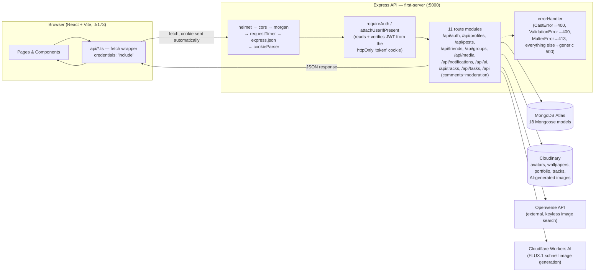

# Architecture — CreativesSelect

This document covers the capstone rubric's Architecture & Planning items (value
statement, system diagram, data model, API design, component tree) and the
Code Understanding item (technical decisions with reasoning), in one place
since they all describe the same system.

---

## 1. Value Statement

**CreativesSelect** is a social platform for creatives — a place to build a
customizable profile (theme colors, wallpaper, portfolio), connect with
friends, join groups for collabs, share posts with optional AI-assisted
writing and images, and leave testimonials on each other's profiles.
Alongside that, it includes a **Help wanted** board (the tasks resource) where creatives post requests for help, browse each other's, and offer to help, behind the same login.

**Target users**: hobbyist and professional creatives (artists, musicians,
writers) who want a space that lets them express a personal aesthetic —
something generic social networks intentionally suppress in favor of a
uniform feed — while still getting the standard social features (friends,
groups, posts, comments).

**Problem solved**: general-purpose social platforms don't let users
customize how their own profile looks, and don't combine creative networking
with a lightweight personal productivity tool in one account. CreativesSelect
does both: one login, one identity, expressive profile + community + a place
to track your own to-dos.

**Value created**: a single account that covers creative self-expression
(profile theme/wallpaper/portfolio), community (friends, groups, comments,
notifications), AI-assisted content creation, and personal organization
(Help wanted) — without needing four different apps.

---

## 2. System Diagram



**Tracing one request** — e.g. loading the Feed page:

1. `FeedPage` mounts, calls `postsApi.feed()`.
2. That calls `api.get("/posts/feed")` in `api/client.ts`, which does
   `fetch("http://localhost:5000/api/posts/feed", { credentials: "include" })`
   — the browser automatically attaches the `token` cookie.
3. Express's middleware chain runs in order: `helmet` (security headers) →
   `cors` (checks the request's Origin against `CLIENT_URL`) → `morgan` +
   `requestTimer` (logging) → `express.json()` (body parsing) →
   `cookieParser()` (splits the cookie header).
4. `postsRouter` is mounted with `postsRouter.use(requireAuth)` — this reads
   `req.cookies.token`, verifies it with `jsonwebtoken` against `JWT_SECRET`,
   and sets `req.user = { id, username }`, or responds `401` if missing/invalid.
5. The route handler queries `Friendship` for the caller's accepted friends,
   then `Post.find({ author: { $in: [self, ...friends] } })`, populates each
   post's `author`, and serializes each through `toPublicUser` (viewer-aware —
   see §7) before responding as JSON.
6. The response flows back through `api/client.ts`, which throws an
   `ApiError` on a non-2xx status; `FeedPage` sets its `status` state to
   `"ready"`, `"error"`, or renders the posts.

---

## 3. Data Model

MongoDB via Mongoose. 13 collections. `ObjectId` refs are named `ref` below;
`unique` compound indexes are noted where they exist.

| Model | Fields | Relationships |
|---|---|---|
| **User** | `email` (unique, lowercased), `username` (unique, lowercased), `passwordHash`, `displayName`, `bio`, `avatarUrl`, `wallpaperUrl`, `wallpaperType` (image/video), `wallpaperPosition`, `isPrivate`, `theme` {bgColor, textColor, accentColor, fontFamily, layoutStyle}, `passwordChangedAt` (sessions issued before it are rejected), timestamps | Referenced by nearly every other model as author/owner/participant |
| **Task** | `owner` → User, `title`, `description`, `isPublic` (default false), `done` (= resolved), `priority` (low/medium/high), `dueDate`, timestamps | Belongs to one User; shown in the UI as a "Help wanted" request — private by default, listed on the public board when `isPublic` |
| **Post** | `author` → User, `content`, `imageUrl`, `isAiText`, `isAiImage`, timestamps | Has many Comments |
| **Comment** | `post` → Post, `author` → User, `content`, timestamps | Belongs to one Post |
| **ProfileComment** | `profileOwner` → User, `author` → User, `content`, timestamps | The profile "guestbook"; distinct from post Comments |
| **Friendship** | `requester` → User, `addressee` → User, `status` (pending/accepted/declined), timestamps | Unique on (requester, addressee); a "friend" = an accepted row in either direction |
| **TopFriend** | `owner` → User, `target` → User, `position`, unique on (owner, target) | Self-curated top-8 list; no consent required from the target |
| **Group** | `name`, `description`, `bannerUrl`, `createdBy` → User, timestamps | Has many GroupMemberships |
| **GroupMembership** | `group` → Group, `user` → User, `role` (member/admin), `joinedAt`, unique on (group, user) | Join table between User and Group |
| **MediaItem** | `owner` → User, `url`, `type` (image/audio/video/embed), `caption`, `isAiImage`, `startSeconds` (video window start), `durationSeconds` (uploaded videos), timestamps | A user's portfolio piece: a picture, an uploaded video (`video`), or a linked video (`embed` for YouTube, `video` for a direct file link) |
| **MediaReaction** | `item` → MediaItem, `user` → User, `value` (+1 like / −1 dislike), unique on (item, user) | One reaction per person per portfolio piece; removed with the piece or the account |
| **UsernameHistory** | `username`, `user` → User, `expireAt` (TTL) | A username someone gave up, reserved for them for 30 days so it can't be instantly taken over |
| **Track** | `owner` → User, `title`, `sourceType` (upload/youtube), `url`, `position`, timestamps | Max 5 per user, enforced in the route, not the schema |
| **StoredAsset** | `owner` → User, `url`, `publicId`, `resourceType` (image/video/raw), `kind` (ai/upload), timestamps | Ledger of every file the server itself stored on Cloudinary (AI images and uploads) and whose it is — the only thing that lets the app delete an asset safely |
| **Notification** | `recipient` → User, `type` (friend_request/friend_accept/comment/profile_comment/group_invite/help_offer/help_accepted), `payload` (Mixed — carries related ids like `actorId`/`friendshipId`), `isRead`, timestamps | Fan-out target for actions elsewhere in the app |
| **RateLimitHit** | `key`, `at`, `expireAt` (TTL index) | One row per rate-limited action; stored in MongoDB so limits survive restarts and are shared by every server instance, and expired rows delete themselves |
| **Block** | `blocker` → User, `blocked` → User, unique on (blocker, blocked), timestamps | Gates visibility everywhere (see §7) |
| **Report** | `reporter` → User, `targetType` (user/post/comment/profileComment), `targetId`, `reason`, `status` (open/reviewed/dismissed), timestamps | Moderation queue; no reviewer UI built yet |

**User-ownership scoping**: every resource that belongs to one user carries an
explicit `owner`/`author` ObjectId, and every route that reads or writes it
filters by `{ ..., owner: req.user.id }` (or the equivalent) — never by the
resource's own `_id` alone. This is what stops one user from touching
another's data (see the Help wanted / tasks mass-assignment fix in the security review).

---

## 4. API Reference

All routes are mounted under `/api`. Auth column: **public** (no auth),
**optional** (`attachUserIfPresent` — works logged out, but personalizes/gates
if logged in), **auth** (`requireAuth` — `401` without a valid session cookie).

### Auth — `/api/auth`
| Method | Path | Auth | Body → Response |
|---|---|---|---|
| POST | `/register` | public | `{email, username, password, displayName}` (username 3–30 letters/numbers/underscores) → `201 {user}`; `429` after 10 registrations per IP per hour |
| POST | `/login` | public | `{email, password}` → `200 {user}`, sets `token` cookie; only *failed* attempts count — `429` (with `Retry-After`) after 10 per email or 30 per IP in 15 minutes |
| PUT | `/password` | auth | `{currentPassword, newPassword}` → `204`; wrong current password `403` (5 failures / 15 min then `429`); every other session is signed out, this one is re-issued |
| POST | `/logout` | public | — → `204`, clears cookie |
| GET | `/me` | auth | → `200 {user}` |

### Profiles — `/api/profiles`
| Method | Path | Auth | Notes |
|---|---|---|---|
| GET | `/?search=` | auth | Search by username/displayName (regex, case-insensitive) |
| PATCH | `/me` | auth | Update own displayName (1–80 chars, trimmed)/bio (≤1000)/avatar/wallpaper/isPrivate/theme; a replaced avatar/wallpaper the server stored is deleted from Cloudinary if nothing else uses it |
| DELETE | `/me` | auth | `{password}` → `204`. Permanently deletes the account and everything it owns (posts, comments on them, friendships, media, tracks, requests, notifications, reports, stored files); groups it created are handed to another member or removed if empty |
| PUT | `/me/top-friends` | auth | `{usernames: string[]}`, max 8 → `200 {topFriends}` (the saved list, same shape as `GET`). Only accepted friends are kept; anything else is ignored |
| PUT | `/me/username` | auth | `{username}` → `200 {user}` and a re-issued session cookie. 3–30 letters/numbers/underscores (stored lowercase); `409` if taken or reserved for someone else (a name you give up stays yours for 30 days); `429` after 3 changes a day |
| DELETE | `/comments/:commentId` | auth | Author or profile owner only |
| GET | `/:username` | optional | `403` if private and viewer isn't owner/friend/unblocked |
| GET | `/:username/top-friends` | optional | Same visibility gate |
| GET | `/:username/comments` | optional | Same visibility gate |
| POST | `/:username/comments` | auth | Same visibility gate; fires a `profile_comment` notification |
| GET | `/:username/tracks` | optional | Same visibility gate |

### Posts — `/api/posts` (entire router requires auth)
| Method | Path | Notes |
|---|---|---|
| GET | `/feed` | Self + accepted friends' posts, newest first, limit 50 |
| GET | `/user/:username` | Gated by the same visibility check as profiles |
| POST | `/` | `{content, imageUrl?, isAiText?, isAiImage?}` → `201` |
| DELETE | `/:id` | Author only; also deletes the post's AI-generated image from Cloudinary if that user generated it and nothing else still uses it |

### Comments on posts — mounted at `/api`
| Method | Path | Auth | Notes |
|---|---|---|---|
| GET | `/posts/:postId/comments` | optional | Gated by the post author's visibility |
| POST | `/posts/:postId/comments` | auth | Same gate; notifies the post author |
| DELETE | `/comments/:id` | auth | Comment author or post author |

### Friends — `/api/friends` (auth)
| Method | Path | Notes |
|---|---|---|
| GET | `/` | Accepted friends |
| GET | `/requests` | Incoming pending requests |
| POST | `/request/:username` | 400 self, 403 blocked, 409 duplicate |
| POST | `/accept/:requestId` | Only the addressee can accept |
| POST | `/decline/:requestId` | Only the addressee can decline |
| DELETE | `/:friendId` | Removes an accepted friendship either direction |

### Groups — `/api/groups` (auth)
| Method | Path | Notes |
|---|---|---|
| GET | `/?search=` | All groups; no group-level privacy exists by design |
| POST | `/` | Creator auto-joins as `admin` |
| GET | `/:id` | — |
| POST | `/:id/join` | 409 if already a member |
| POST | `/:id/leave` | — |
| GET | `/:id/members` | Viewer-aware user serialization (see §7) |

### Media — `/api/media`
| Method | Path | Auth | Notes |
|---|---|---|---|
| POST | `/upload` | auth | multipart, `?purpose=avatars\|wallpapers\|portfolio\|tracks`, 30MB limit → `413`, streamed to Cloudinary. Portfolio accepts images (≤10 MB on the free plan → `413` with a clear message) **and videos** (mp4/webm/quicktime): the length is measured by the storage provider and a video over **30 seconds** (or of unknown length) is deleted again and refused with `400` |
| POST | `/` | auth | Add a portfolio item by URL. `{type: "image", url}` (https, or an inline AI image) or `{type: "video", url, startSeconds?}` where the link must be **YouTube** (→ `embed`, canonical URL) or a **direct https .mp4/.webm/.mov/.m4v** file (→ `video`, `#fragment` dropped); anything else `400`. Linked videos can't be measured, so they play as a 30-second window from `startSeconds` |
| GET | `/user/:username` | optional | Gated by visibility; each item carries `likes`, `dislikes` and (when signed in) the viewer's `myReaction` |
| PUT | `/:id/reaction` | auth | `{value: 1 \| -1 \| 0}` (like / dislike / clear) → `{likes, dislikes, myReaction}`; one reaction per person; `404` if the item is missing **or the profile isn't visible to you** (private/blocked); 300 per hour |
| DELETE | `/:id` | auth | Owner only; also removes its reactions and, if nothing else uses it, the stored file |

### Notifications — `/api/notifications` (auth)
| Method | Path | Notes |
|---|---|---|
| GET | `/` | Latest 50, with resolved actor + live friendship status |
| POST | `/read-all` | — |
| POST | `/:id/read` | Scoped to own recipient id |
| POST | `/:id/accept-offer` | Owner of a help request accepts an offer notification → notifies the offerer (`help_accepted`), once; `404` for anyone but the recipient |

### Moderation — mounted at `/api` (auth)
| Method | Path | Notes |
|---|---|---|
| POST | `/users/:username/block` | 400 on self-block; deletes any existing friendship |
| DELETE | `/users/:username/block` | Unblock |
| POST | `/reports` | Validates `targetType` enum + required fields |

### AI — `/api/ai` (auth)
| Method | Path | Notes |
|---|---|---|
| POST | `/text` | `{prompt, kind}` → `{text}`; 400 if prompt missing. Real Llama 3.1 8B via Cloudflare Workers AI when configured (max 30 per user per hour, `429` beyond), canned templates otherwise |
| POST | `/image` | `{prompt, kind}` → `{url}`; 400 if prompt missing. Real Cloudflare Workers AI generation when configured (returns a Cloudinary URL), mock gradient (`data:` URI) otherwise; `429` after 10 per user per hour (real provider only); `503` if the provider is unavailable or its free allowance is spent |
| GET | `/images/search?q=` | Live Openverse search, no key required |

### Tracks — `/api/tracks` (auth)
| Method | Path | Notes |
|---|---|---|
| POST | `/` | Max 5 per user; extracts a YouTube video id from a full URL |
| DELETE | `/:id` | Owner only; re-numbers remaining positions |

### Help wanted (tasks) — `/api/tasks` (auth) — the full-CRUD user-owned resource plus a public board
| Method | Path | Notes |
|---|---|---|
| GET | `/?done=&sort=&page=&limit=` | Owner-scoped; filter/sort/paginate |
| GET | `/board` | Open (`done=false`), public requests from *other* users, newest first (max 100). Requests from blocked users, and from private-profile users who aren't your friends, are omitted entirely |
| POST | `/:id/offer` | Offer to help on someone's public, open request → notifies the owner (`help_offer`), once per offerer per request, max 20 per user per hour (`429`). Optional `{message}` (≤300 chars) is shown to the owner. `400` on your own request; `404` if it's private/missing/not visible to you |
| GET | `/:id` | Owner-scoped; `404` (not `403`) if not yours |
| POST | `/` | `{title, description?, isPublic?, priority?, dueDate?}` → `201`; only those fields are read from the body; public posts capped at 10 per user per hour (`429`) |
| PUT | `/:id` | Whitelisted fields only (`title`, `description`, `isPublic`, `done`, `priority`, `dueDate`) — `owner` cannot be overwritten via the body |
| DELETE | `/:id` | Owner-scoped |

---

## 5. Deployment

| Layer | Platform | Notes |
|---|---|---|
| Backend (`first-server`) | [Render](https://render.com), free web service tier, via `render.yaml` blueprint | `npm install` / `npm start`; `NODE_ENV=production` committed, `MONGODB_URI`/`JWT_SECRET`/`CLIENT_URL`/`CLOUDINARY_*`/`CLOUDFLARE_*` set as dashboard-only secrets (`sync: false`), never committed |
| Frontend | [Vercel](https://vercel.com) | Auto-detected Vite build; `vercel.json` adds a catch-all rewrite to `index.html` so client-side routes (e.g. `/register`, `/u/:username`) don't 404 on direct navigation. Project settings: **Root Directory = `frontend`**, **Install Command = `npm ci`**; production deploys come **only from CI**: `vercel.json` sets `git.deploymentEnabled: false`, and the `deploy` job in `.github/workflows/ci.yml` builds and ships with the Vercel CLI (secrets `VERCEL_TOKEN`, `VERCEL_ORG_ID`, `VERCEL_PROJECT_ID`) only after lint, build, tests and audit pass on `master`. Side effect: no per-PR preview deployments. `vercel.json` also **proxies `/api/*` to the Render API** so cookies are first-party (see the same-origin proxy note below), and the site is an **installable web app** (`manifest.webmanifest`, icons, Apple meta tags) |
| AI image generation | Cloudflare Workers AI (FLUX.1 schnell), free daily allowance | Needs `CLOUDFLARE_ACCOUNT_ID` + `CLOUDFLARE_API_TOKEN`; without them the backend uses the mock provider. Results are re-hosted on Cloudinary |
| Database | MongoDB Atlas, free tier | Network Access allow-list set to `0.0.0.0/0` — Render's free tier has no static egress IP, so per-IP allow-listing isn't an option |
| CI | GitHub Actions, both repos | On every push and pull request. Backend: tests against a throwaway MongoDB 7 service container (no secrets, never Atlas) + `npm audit --audit-level=high`. Frontend: `oxlint`, `npm run build` (which runs `tsc -b`, type-checking the tests — the same command Vercel runs), the Vitest suite, and `npm audit`. Dependabot proposes weekly npm and monthly Actions updates, and CI runs on those PRs too. **Deploy gating:** frontend — enforced as above (verified: one push produced exactly one production deploy, from CI). Backend — `render.yaml` sets `autoDeployTrigger: checksPass`, and the Render service's Auto-Deploy setting must be "After CI Checks Pass" for it to take effect. A separate `keep-warm` workflow pings `/api/health` every 10 minutes (public repos run scheduled workflows free) so Render's free tier rarely sleeps; the frontend also pings it on page load. **Browser end-to-end job (both repos):** Playwright drives the built frontend in desktop Chrome, desktop WebKit (Safari's engine) and an iPhone-sized WebKit against a real API and a throwaway MongoDB (36 tests × 3 browsers, 102 runs — three phone-only tests run only on the iPhone project). The frontend repo runs it against the latest API and the API repo against the latest frontend; the frontend deploy waits for it, and a failure uploads the Playwright report, traces, screenshots and the API log |
| Media storage | Cloudinary, free tier | Avatars/wallpapers/portfolio/tracks stream directly here (explained below); nothing is written to the backend's own filesystem |

**Why Cloudinary, not local disk.** Render's free-tier filesystem is
ephemeral — anything written to it is lost on every restart or redeploy.
Early on, uploads used `multer.diskStorage()`, which meant every avatar,
wallpaper, and portfolio image silently vanished the next time the service
redeployed. Uploads now stream directly to Cloudinary via a small custom
`multer` storage engine, and the database stores Cloudinary's returned CDN
URL instead of a local path — see the Security Review for the full incident
and the dependency conflict that complicated the fix.

**Same-origin API proxy, so the login cookie is first-party.** The frontend
(`vercel.app`) and the API (`onrender.com`) are different sites. The first design
used a `SameSite=None; Secure` cookie for that cross-site setup — which works in
Chrome but **not on iOS**: Safari (and every browser on iOS, which all use its
engine) blocks cookies set by a different site than the page even when they're
`SameSite=None`, so login would appear to succeed and then every page would act
signed out. So the frontend now calls `/api/...` on its own domain and
`vercel.json` rewrites `/api/:path*` to the Render API (listed before the SPA
catch-all). The browser only ever talks to one domain; the cookie is host-only
and first-party, and can be `SameSite=Lax` — stricter, and enough because
requests are now same-origin. In production `src/api/base.ts` makes the API base
empty (same origin); in development it's `VITE_API_URL` or
`http://localhost:5000`. Behind the proxy Render sees Vercel's address, so per-IP
rate limits read Vercel's `x-vercel-forwarded-for` (the real client IP) via
`utils/clientIp.js`. Verified live through the proxy: host-only Secure/HttpOnly
cookie, real client IP reaching the limiter, a 10 MB upload and AI image
generation passing, and a full browser sign-up → post → reload → logout flow.
Confirmed working on physical iPhones by the project owner (a manual check, not automated),
on top of Safari's documented cookie policy, the first-party test in a desktop browser and
the WebKit/iPhone-sized runs in CI.

**Known limitation**: Render's free tier spins down after inactivity, so the
first request after idle time is slow (cold start, tens of seconds) —
disclosed to the user, not fixed, since it's a paid-tier upgrade, not a code
change.

---

## 6. Component Tree

```
App
├── AuthProvider            (fetches /api/auth/me once; exposes {user, isLoading, setUser})
│   └── PlaybackProvider     (global "now playing" state — survives navigation)
│       ├── NavBar           (links + NotificationBell)
│       ├── Routes
│       │   ├── /login       → LoginPage
│       │   ├── /register    → RegisterPage
│       │   ├── ProtectedRoute (redirects to /login if !user)
│       │   │   ├── /          → FeedPage        (PostComposer, PostCard[] → PostCommentList)
│       │   │   ├── /friends   → FriendsPage
│       │   │   ├── /groups    → GroupsPage
│       │   │   ├── /groups/:id→ GroupDetailPage
│       │   │   ├── /search    → SearchPage
│       │   │   └── /help-wanted → TasksPage: public board + my requests (/tasks redirects here)
│       │   ├── /u/:username → ProfilePage (attachUserIfPresent server-side, not client-gated)
│       │   │   ├── ThemeEditor, ImagePositioner
│       │   │   ├── TopFriendsList
│       │   │   ├── MusicPlayer            (uses usePlayback())
│       │   │   ├── PortfolioGrid
│       │   │   └── ProfileComments
│       │   └── *            → redirect to /
│       └── NowPlayingBar    (renders when PlaybackContext.current is set)
```

**Where API calls live**: each page owns its own data-fetching in a
`useEffect`/`load()` function, calling a matching `api/*.api.ts` module
(`posts.api.ts`, `groups.api.ts`, `friends.api.ts`, `tasks.api.ts`,
`profiles.api.ts`, `notifications.api.ts`, `ai.api.ts`, `media.api.ts`),
which all wrap the single `api` object in `api/client.ts` — one place that
sets `credentials: "include"` and turns a non-2xx response into a thrown
`ApiError`. No component talks to `fetch` directly except `media.api.ts`'s
`uploadFile`, which needs `FormData` instead of JSON.

---

## 7. Technical Decisions

**Cookie-based JWT, not an Authorization header.** The token is signed with
`jsonwebtoken` and stored in an httpOnly cookie named `token` (`middleware/auth.js`),
not sent back to the client as a string the frontend has to store. This means
XSS can't read the token out of `localStorage`, and the frontend never
touches it directly — `credentials: "include"` on every `fetch` call is the
entire client-side auth story.

**Why MongoDB/Mongoose over a relational DB.** The original prototype used
Prisma + SQLite; the project was consolidated onto a single Express +
Mongoose backend (`first-server`) so the whole app — the original social
features and the Help wanted list — runs on one server, one database, one login,
instead of two separate backends with two separate auth systems.

**Centralized visibility check (`utils/visibility.js`).** Early on, the
profile page's own `isPrivate`/block check existed, but every *other* route
that also exposed a user's content (their posts, their portfolio, comments on
their posts, their top-friends list) had its own copy — or no copy at all.
`assertVisible(user, viewerId)` is now the single function every one of those
routes calls, so "is this private, and is the viewer blocked or a stranger"
is answered the same way everywhere, instead of being reimplemented (and
sometimes forgotten) per route.

**Viewer-aware serialization (`toPublicUser(user, viewerId)`).** A private
user's `bio`/`wallpaperUrl`/`theme`/`email` shouldn't be visible to a
stranger just because that user showed up embedded somewhere else — a
group roster, a comment's author, a notification's actor. `toPublicUser`
takes the current viewer's id and returns either the full profile shape or
`User.toPublicRestricted()` (identity fields only), based on whether the
viewer is the user themselves or an accepted friend.

**`Task.owner` is never taken from the request body.** `PUT /tasks/:id`
whitelists exactly `title`/`done`/`priority`/`dueDate` into the update
document — `owner` is set once, at creation, from the authenticated
session, and can't be reassigned through the update body even by the task's
own current owner.

**A pluggable AI provider: real when configured, mock otherwise.**
`services/ai/index.js` picks the provider: `CloudflareAIProvider` when both
Cloudflare credentials are set, `MockAIProvider` otherwise. Every provider
implements the same `generateText` / `generateImage` / `searchImages`
surface, so the routes never know which is active. The mock is kept on
purpose — it lets local development, the test suite and any un-configured
deploy run with zero API keys — but it only hashes the prompt into a
gradient and never interprets it, which is why users reported "AI pictures
don't match what I asked for" until the real provider went in.
`CloudflareAIProvider` extends the mock, replacing `generateText` (Llama 3.1)
and `generateImage` (FLUX.1) while photo search inherits the existing
Openverse behavior.
Generated images are uploaded to Cloudinary and the CDN URL is stored,
rather than storing multi-megabyte base64 on a user or post document. Since
the free daily allowance is shared by every user, `/api/ai/image` is capped
at 10 per user per hour while the real provider is active; provider errors
are logged server-side and never forwarded to clients, and account-level
failures (bad token, exhausted allowance) surface as "temporarily
unavailable" instead of "try again", since retrying can't fix them.

**A custom Cloudinary storage engine, not the off-the-shelf package.**
`multer-storage-cloudinary` is the obvious choice for wiring `multer` to
Cloudinary, but its latest release pins a peer dependency on
`cloudinary@^1.x` — incompatible with the `cloudinary@^2.7.0` needed for a
patched security advisory (see the Security Review, §5.1). Rather than
accept the vulnerable SDK version just to keep the convenience package, a
~15-line custom `StorageEngine` calls `cloudinary.uploader.upload_stream`
directly — the same call the package made internally — removing the
conflicting dependency entirely.

**Centralized error handling grew by one case.** `errorHandler.js` started
by mapping `CastError`→`400`. A Mongoose `ValidationError` (a required field
missing, an invalid enum value) got the same generic `500` as a genuine
server bug until a second pass added a `ValidationError`→`400` case too —
fixed once, in the one place every route's errors already flow through,
rather than adding input validation to each route individually.

**Three layers of tests, each faking only what it must.**
(1) *Backend* (`first-server`): Vitest + Supertest against a dedicated
`creativeselect_test` database — 119 tests over auth (throttling, CSRF, session
revocation), Tasks and the Help wanted board, friends, blocking, reports, groups,
portfolio media (reactions, video uploads and links), profile editing, account
deletion, password change, uploads (including a storage account that refuses them) and stored-asset cleanup (Cloudinary is mocked).
(2) *Frontend units*: Vitest + Testing Library in jsdom — 221 tests with the `api/*`
modules mocked, so they check what the UI does with server responses (errors shown,
buttons disabled, requests sent). Every page and nearly every component is covered:
login, register, feed, friends, groups and group detail, profile, search, Help wanted,
nav bar, notification bell, post composer/card/comments, portfolio, music player, top
friends, profile names, testimonials, delete-account, change-password, the AI buttons,
avatar, the auth context and the video helpers. Test files are type-checked by `tsc -b`
as part of the Vercel build, so a type error in a test blocks a deploy.
(3) *Browser end-to-end* (`frontend/e2e`, Playwright): real browsers against the built
frontend, a real API and MongoDB — sign-up/in/out and a session that survives a reload,
posting, profile rename, top friends, password change and account deletion, portfolio
pictures/reactions/video links, friends, groups, private profiles, the Help wanted flow
between two users, and phone layout (menu, no sideways scrolling, tap targets).
Not covered by automated tests: real Cloudinary uploads (including the 30-second video
check), real AI generation and Openverse search — CI has no keys for them, so those are
checked by scripted and manual runs against production — plus the audio player context,
theme editor and image positioner units.

**Videos: a 30-second limit that's measured where it can be, and clipped where it can't.**
Uploaded videos (mp4/webm/iPhone .mov, ≤30 MB) go to Cloudinary, which reports the length
of the file it has just ingested; the API refuses and deletes anything over 30 seconds
(0.75 s slack) or of unknown length, so the limit can't be bypassed by skipping the
browser's own pre-check (which exists only to fail fast, before a 30 MB upload). Playback
asks Cloudinary for an H.264 MP4 of the file (`f_mp4,vc_h264`) because phones often
produce HEVC that most browsers can't play, plus a first-frame poster. Linked videos are
never downloaded, so they can't be measured: a YouTube link becomes a
`youtube-nocookie.com` embed with `start`/`end` set to a 30-second window, and a direct
file link plays with a `#t=start,end` media fragment plus a player guard that pauses at the
end. The link parser accepts only https YouTube links and direct video files — parsed with
`new URL`, not a regex over the text, so `https://evil.example/?u=youtube.com/watch?v=…`
is refused — so a stored value is always safe to put in an `<iframe>`/`<video>` `src`.

**Usernames are public addresses, so changes are constrained.** Letters, numbers and
underscores only (spaces and slashes used to be accepted at registration and broke
`/u/:username` URLs); unique case-insensitively; 3 changes a day; and the name you give up
is reserved for you for 30 days (`UsernameHistory`, TTL-indexed) so nobody can instantly
take it to impersonate you or capture old links. The session cookie is re-issued because it
carries the username.

**Profile pages ignore answers from requests they've moved past.** After a rename the page
briefly re-requested the *old* address (now a 404); if that 404 arrived after the new
profile had loaded it overwrote it with "unavailable". Found in a real-browser test — the
unit tests had passed because their mocks answered in order. The effect now cancels stale
results, with a regression test that fails without the guard.

**Browser tests run the production topology.** `vite preview` serves the production build
with `/api` proxied to the API — the same same-origin shape Vercel gives in production — so
the login cookie is first-party in the tests exactly as it is live. Running the suite in
WebKit (Safari's engine, desktop and iPhone-sized) is the closest automated check for the
iOS cookie policy that motivated that design: "still signed in after a reload" passes there.
Each test creates uniquely named users and claims its own client IP through
`x-vercel-forwarded-for` (the header the API's per-IP limits already read), so the
registration limit doesn't throttle a big run and tests never depend on each other or on
leftover data — the Help wanted test even has to pick its own request off a shared board.
Locally the suite runs against a throwaway database, never the real one. Writing it also
surfaced real bugs, not only test mistakes (see the security review §5.23).

**Failed background requests must not become unhandled rejections.** The
notification bell polls every 30 seconds and the top-friends list loads on
every profile view; both originally had no `catch`, so an offline blip, a
sleeping free-tier server, or a private profile's `403` surfaced as "Uncaught
(in promise)" console errors. Polls now keep the last known state and retry,
and user-initiated actions (Edit/Save top friends, mark read) show the
server's message or recover. Page titles (`lib/usePageTitle.ts`) update per
route (`Help wanted · CreativesSelect`, `@username · CreativesSelect`), and
the app ships its own favicon, meta description, focus rings and
reduced-motion support.

**Deleting stored files safely: a ledger, not a URL check.** A post's
`imageUrl` (and a portfolio item's, and a group banner's) is client-supplied,
so "delete the Cloudinary asset this points at" would let anyone delete
anyone's file by submitting its URL. Instead, whenever the server itself
stores a file — an AI image or an upload — `StoredAsset` records whose it is.
A file is deleted only if a ledger entry exists **for that user**, and only
when nothing else (another post, avatar/wallpaper, portfolio item, track or
group banner) still references the URL: when a post, portfolio item or track
is deleted, or an avatar/wallpaper is replaced. Account deletion removes every
file in the user's ledger. Deletions purge Cloudinary's CDN cache (found in
live testing: a deleted image kept being served from cache) and never fail
the user's own action — errors are logged and the record is deleted anyway.
Files stored before the ledger existed have no entry and are left alone.

**Abuse protection: one shared limiter, plus an origin check.** All rate
limits (login/registration, AI, the board, password and deletion attempts)
use one MongoDB-backed sliding-window limiter (`utils/rateLimit.js`) instead
of per-process memory, so they survive a restart and hold across instances.
Login counts only failed attempts — per email (stops guessing one account from
many IPs) and per IP (stops one client trying many accounts) — so normal use
never burns the budget; it fails open if the database call itself errors,
rather than locking everyone out. `app.set('trust proxy', 1)` makes `req.ip`
the real client behind Render (and `clientIp()` prefers Vercel's forwarded header when
requests arrive through the frontend proxy). The cookie is `SameSite=Lax` (it was `None` before the same-origin proxy), which already
keeps modern browsers from attaching it to cross-site POSTs; `middleware/csrf.js` still rejects state-changing
requests whose `Origin` header isn't the frontend (`403`). Requests with no
`Origin` (curl, server-to-server) can't be forged from a victim's browser, so
they pass.

**Sessions are revalidated on every request.** A signed JWT stays valid for 7
days on its own, so `requireAuth` also loads the user (one indexed lookup) and
rejects the token if the account no longer exists or the token was issued
before `passwordChangedAt`. Found while building account deletion: a copied
token from a deleted account still passed `requireAuth` and could create
posts under the dead id (reproduced live). A password change now signs out
every other session and re-issues the current one; a database error during the
check is a `500`, not a fake logout.

**Installable web app, not an App Store app.** `public/manifest.webmanifest`,
the `apple-touch-icon` and the `apple-mobile-web-app-*` meta tags make
"Add to Home Screen" (iOS Safari: Share → Add to Home Screen; Android Chrome: menu →
Install app) give the site an icon and a full-screen, browser-chrome-free window.
There is deliberately no service worker: offline caching would risk serving stale
bundles after a deploy for no real benefit to a server-backed social app. A native
App Store build would need a wrapper (e.g. Capacitor), an Apple developer account and
Apple's review for little extra over this. The icons are drawn from the same mark as
the favicon; the maskable variant leaves a safe margin for Android's shapes.

**Uploads fail with a message, not a 500.** Cloudinary's free plan caps images at
10 MB; the API used to surface that as a generic "Internal server error" (found while
testing large uploads through the proxy — it happens with or without the proxy).
`middleware/upload.js` now maps it to `413` with a plain message and any other storage
failure to `502` without leaking internals, and the frontend's `uploadFile` throws an
`ApiError` so the message reaches the user.

**Dynamic import for `app.js` in `server.js`.** The Express app was split
into `app.js` (middleware + routes) and `server.js` (env loading + listen)
so tests could import the app without opening a real port. Static imports
are hoisted above the rest of a file, so a static `import { app }` would
build `app.js`'s `cors()` middleware — which reads `process.env.CLIENT_URL`
once — *before* `loadEnv()` runs. `server.js` uses `await import("./app.js")`
after `loadEnv()` specifically to avoid that ordering bug (found and fixed
this week — see the security review).
