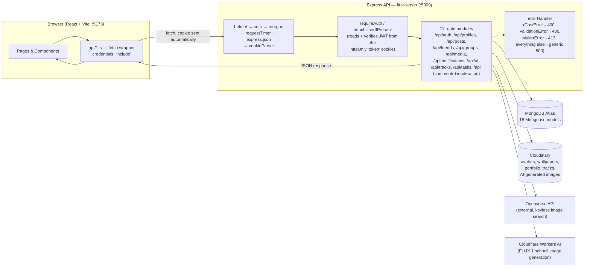

# Architecture — CreativesSelect

This document covers the capstone rubric's Architecture & Planning items (value
statement, system diagram, data model, API design, component tree) and the
Code Understanding item (technical decisions with reasoning), in one place
since they all describe the same system.

---

## 1. Value Statement

**CreativesSelect** is a social platform for creatives — a place to build a
customizable profile (theme colors, wallpaper, portfolio), connect with
friends, join groups for collabs, share posts with optional AI-assisted
writing and images, and leave testimonials on each other's profiles.
Alongside that, it includes a **Help wanted** board (the tasks resource) where creatives post requests for help, browse each other's, and offer to help, behind the same login.

**Target users**: hobbyist and professional creatives (artists, musicians,
writers) who want a space that lets them express a personal aesthetic —
something generic social networks intentionally suppress in favor of a
uniform feed — while still getting the standard social features (friends,
groups, posts, comments).

**Problem solved**: general-purpose social platforms don't let users
customize how their own profile looks, and don't combine creative networking
with a lightweight personal productivity tool in one account. CreativesSelect
does both: one login, one identity, expressive profile + community + a place
to track your own to-dos.

**Value created**: a single account that covers creative self-expression
(profile theme/wallpaper/portfolio), community (friends, groups, comments,
notifications), AI-assisted content creation, and personal organization
(Help wanted) — without needing four different apps.

---

## 2. System Diagram


```mermaid
flowchart LR
    subgraph Browser["Browser (React + Vite, :5173)"]
        UI["Pages & Components"]
        APIClient["api/*.ts — fetch wrapper\ncredentials: 'include'"]
    end

    subgraph Server["Express API — first-server (:5000)"]
        MW["helmet → cors → morgan\n→ requestTimer → express.json\n→ cookieParser"]
        Routes["11 route modules\n/api/auth, /api/profiles, /api/posts,\n/api/friends, /api/groups, /api/media,\n/api/notifications, /api/ai,\n/api/tracks, /api/tasks, /api (comments+moderation)"]
        Auth["requireAuth / attachUserIfPresent\n(reads + verifies JWT from the\nhttpOnly 'token' cookie)"]
        ErrH["errorHandler\n(CastError→400, ValidationError→400,\nMulterError→413, everything else→generic 500)"]
    end

    DB[("MongoDB Atlas\n18 Mongoose models")]
    Cloudinary[("Cloudinary\navatars, wallpapers,\nportfolio, tracks,\nAI-generated images")]
    Openverse["Openverse API\n(external, keyless image search)"]
    CFAI["Cloudflare Workers AI\n(FLUX.1 schnell image generation)"]

    UI --> APIClient
    APIClient -- "fetch, cookie sent automatically" --> MW
    MW --> Auth --> Routes
    Routes --> DB
    Routes --> Cloudinary
    Routes --> Openverse
    Routes --> CFAI
    Routes -.-> ErrH
    Routes -- "JSON response" --> APIClient
    APIClient --> UI
```

**Tracing one request** — e.g. loading the Feed page:

1. `FeedPage` mounts, calls `postsApi.feed()`.
2. That calls `api.get("/posts/feed")` in `api/client.ts`, which does
   `fetch("http://localhost:5000/api/posts/feed", { credentials: "include" })`
   — the browser automatically attaches the `token` cookie.
3. Express's middleware chain runs in order: `helmet` (security headers) →
   `cors` (checks the request's Origin against the address(es) in `CLIENT_URL`) → `morgan` +
   `requestTimer` (logging) → `express.json()` (body parsing) →
   `cookieParser()` (splits the cookie header).
4. `postsRouter` is mounted with `postsRouter.use(requireAuth)` — this reads
   `req.cookies.token`, verifies it with `jsonwebtoken` against `JWT_SECRET`,
   and sets `req.user = { id, username }`, or responds `401` if missing/invalid.
5. The route handler queries `Friendship` for the caller's accepted friends,
   then `Post.find({ author: { $in: [self, ...friends] } })`, populates each
   post's `author`, and serializes each through `toPublicUser` (viewer-aware —
   see §7) before responding as JSON.
6. The response flows back through `api/client.ts`, which throws an
   `ApiError` on a non-2xx status; `FeedPage` sets its `status` state to
   `"ready"`, `"error"`, or renders the posts.

---

## 3. Data Model

MongoDB via Mongoose. 41 collections. `ObjectId` refs are named `ref` below;
`unique` compound indexes are noted where they exist.

| Model | Fields | Relationships |
|---|---|---|
| **User** | `email` (unique, lowercased), `username` (unique, lowercased), `passwordHash`, `displayName`, `bio`, `avatarUrl`, `wallpaperUrl`, `wallpaperType` (image/video), `wallpaperPosition`, `wallpaperMotion` (none/zoom/drift/pan/pulse — how a picture wallpaper moves), `mood` (≤60), `listeningTo` (≤80), `tags` (≤8 lower-case tags of 2–24 characters, indexed; returned only on profiles the viewer may see), `sectionOrder` (the order of the profile's sections: about, friends, music, portfolio, blog, testimonials — always returned complete; a section added later follows the ones already placed), `about` {interests, music, movies, books, meet — each ≤300}, `location` (≤60) with `locationAudience` (friends/everyone), `birthday` {month, day} (no year; setting it shares it with friends and has them reminded) and `lastBirthdayYear` (never returned; read through `/api/about`, not with the user) and `hiddenSections` (sections hidden from visitors), `isPrivate`, `theme` {bgColor, textColor, accentColor, fontFamily, layoutStyle}, `passwordChangedAt` (sessions issued before it are rejected), `bulletinsSeenAt` (when they last looked at the bulletin board; never returned to anyone), `onboardingDismissedAt` (when they hid the getting-started checklist; never returned to anyone), `suspendedAt` and `suspensionNote` (a moderator has suspended the account; the note is seen only by moderators), `lastActiveAt` (when their open page last checked in; never returned as a time) and `showActivity` (default on: whether friends may see "online now" / "active today"; returned only to the owner) and `profileViews` (default **off**: opt-in to see who visits your profile and to be seen when you visit others'; returned only to the owner), `csVerifiedByAdmin` / `csVerifiedAdminAt` (an administrator gave the CSverified badge) and `csVerifiedEarned` / `csVerifiedEarnedAt` (earned with 1,000 active friends); only `csVerified`, true if either, is ever returned, and nothing a person sends can set these, timestamps | Referenced by nearly every other model as author/owner/participant |
| **Task** | `owner` → User, `title`, `description`, `isPublic` (default false), `done` (= resolved), `priority` (low/medium/high), `dueDate`, timestamps | Belongs to one User; shown in the UI as a "Help wanted" request — private by default, listed on the public board when `isPublic` |
| **Post** | `author` → User, `content`, `imageUrl`, `imageAspect` (original/1:1/4:3/16:9), `imageZoom` (1–3), `imagePosition` ("x% y%"), `isAiText`, `isAiImage`, timestamps | Has many Comments. The three framing fields are how the author shaped, zoomed and placed the picture; they are absent on posts made before framing existed, which are shown as they always were |
| **DismissedSuggestion** | `owner` → User, `target` → User, unique on (owner, target) | Someone a person said "Not interested" to under People you may know (at most 500 kept per person); removed with either account |
| **BlogComment** | `entry` → BlogEntry, `author` → User, `content` (≤1000, may be empty with a picture), `imageUrl`, `editedAt`, timestamps, indexed on (entry, _id) | A comment on a blog entry; removed with the entry or either account |
| **BlogEntry** | `author` → User, `title` (≤120), `body` (≤10,000, plain text; blank lines separate paragraphs), timestamps, indexed on (author, createdAt) | A longer journal / blog entry on a profile, kept apart from the short feed posts. Visible exactly when its author's profile is |
| **ProfileView** | `owner` → User, `viewer` → User, `lastViewedAt`, `expireAt` (TTL, 30 days after the visit), unique on (owner, viewer) | The last time one person looked at another's profile. Exists only when **both** have profile views on; one row per pair; deleted when either turns it off or deletes their account |
| **Bulletin** | `author` → User, `title` (≤80), `body` (≤500, plain text), `expireAt` (TTL, 10 days after posting), timestamps | A short message to all of the author's friends at once. Readable only by the author and their accepted friends, and removes itself after 10 days |
| **Comment** | `post` → Post, `author` → User, `content` (≤1000, may be empty with a picture), `imageUrl` (one uploaded picture, optional), `editedAt`, timestamps | Belongs to one Post |
| **ProfileComment** | `profileOwner` → User, `author` → User, `content`, `imageUrl`, `editedAt`, timestamps | The profile "guestbook"; distinct from post Comments |
| **Friendship** | `requester` → User, `addressee` → User, `status` (pending/accepted/declined), timestamps | Unique on (requester, addressee); a "friend" = an accepted row in either direction |
| **TopFriend** | `owner` → User, `target` → User, `position`, unique on (owner, target) | Self-curated top-8 list; no consent required from the target |
| **Group** | `name`, `description`, `bannerUrl`, `createdBy` → User, timestamps | Has many GroupMemberships |
| **GroupMembership** | `group` → Group, `user` → User, `role` (member/admin), `joinedAt`, unique on (group, user) | Join table between User and Group |
| **MediaItem** | `owner` → User, `url`, `type` (image/audio/video/embed), `caption`, `isAiImage`, `startSeconds` (video window start), `durationSeconds` (uploaded videos), `album` → Album (null when in none), timestamps | A user's portfolio piece: a picture, an uploaded video (`video`), or a linked video (`embed` for YouTube, `video` for a direct file link) |
| **MediaComment** | `item` → MediaItem, `author` → User, `content` (≤1000), `imageUrl`, `editedAt`, timestamps, indexed on (item, _id) | A comment on a portfolio piece; removed with the piece or either account |
| **Album** | `owner` → User, `title` (≤60), timestamps, indexed on (owner, createdAt) | A named group of a person's portfolio pieces (max 12 per person, names unique per person ignoring case). It holds no pictures itself: each piece names its album. Deleting an album keeps its pieces |
| **MediaReaction** | `item` → MediaItem, `user` → User, `value` (+1 like / −1 dislike), unique on (item, user) | One reaction per person per portfolio piece; removed with the piece or the account |
| **UsernameHistory** | `username`, `user` → User, `expireAt` (TTL) | A username someone gave up, reserved for them for 30 days so it can't be instantly taken over |
| **Track** | `owner` → User, `title` (≤100), `artist` (≤80, optional), `sourceType` (upload/youtube), `url`, `position`, `profileSong` (at most one per owner), `plays`, timestamps | Max 20 per user, of which at most 5 uploaded, enforced in the route, not the schema |
| **TrackPlay** | `track` → Track, `listener` → User, `createdAt` (TTL, one day), unique on (track, listener) | The day's record that makes a listener's plays of one song count once; only the total on the track is kept for good |
| **StoredAsset** | `owner` → User, `url`, `publicId`, `resourceType` (image/video/raw), `kind` (ai/upload), timestamps | Ledger of every file the server itself stored on Cloudinary (AI images and uploads) and whose it is — the only thing that lets the app delete an asset safely |
| **Notification** | `recipient` → User, `type` (friend_request/friend_accept/comment/profile_comment/group_invite/help_offer/help_accepted/live_started/message/live_scheduled/live_reminder/blog_post/invite_joined/media_comment/event_created/event_updated/event_cancelled/event_reminder/friend_birthday/blog_comment/cs_verified), `payload` (Mixed — carries related ids like `actorId`/`friendshipId`), `isRead`, timestamps | Fan-out target for actions elsewhere in the app |
| **Message** | `sender` → User, `recipient` → User, `pair` ("smaller id:larger id" — one key per two people, indexed with `createdAt`), `body` (≤2000 chars), `readAt`, timestamps | A direct message between two friends; one document is both people's copy, so a delete or account deletion removes it for both |
| **GroupMessage** | `group` → Group, `sender` → User, `body` (≤1000 chars), timestamps | A message in a group's chat; only members can read or write; removed with its sender's account or its group |
| **GroupTopic** | `group` → Group, `author` → User, `title` (≤100), `body` (≤2000), `pinned`, `replyCount`, `lastActivityAt`, timestamps, indexed on (group, pinned, lastActivityAt) | A discussion topic on a group's board; members only. Rises when replied to; an admin can pin up to 3 |
| **GroupReply** | `topic` → GroupTopic, `group` → Group, `author` → User, `body` (≤1000), timestamps | A reply in a board topic; removed with its topic |
| **Invite** | `inviter` → User, `code` (unique, 96 random bits, URL-safe), `maxUses` (10), `uses`, `revokedAt`, `joined` [{user, at}], `expireAt` (TTL, 7 days) | A link someone shares so a friend can join and be their friend straight away. Expires after a week, works for at most 10 sign-ups, can be switched off |
| **ModerationAction** | `admin` → User, `targetType`, `targetId`, `subject` → User (the author, or the account), `action` (dismissed/removed/suspended/removed_and_suspended/unsuspended/verified/unverified), `note` (≤500), `reportCount`, `createdAt` | The record of what moderators decided. Holds identifiers and the moderator's note, never the removed content |
| **PasswordReset** | `user` → User, `tokenHash` (SHA-256, unique), `expireAt` (TTL, 1 hour) | At most one outstanding "reset my password" link per user; only a hash of the token is stored, so the database never holds a usable link |
| **LiveSession** | `host` → User, `title` (≤80), `status` (live/ended), `lastHeartbeat`, `endedAt`, `expireAt` (TTL, set when it ends) | One voice-only live broadcast. It counts as live only while its host keeps sending heartbeats |
| **Event** | `host` → User, `title` (≤80), `description` (≤1000), `startsAt`, `endsAt` (optional, ≤3 days after the start), `kind` (in_person/online), `place` (≤120, in person), `link` (https only, online), `audience` (friends/public), `editedAt`, `remindedAt`, `expireAt` (TTL, two days after it ends) | Something a person organises: a meet-up, a show, an online session |
| **EventRsvp** | `event` → Event, `user` → User, `status` (going/maybe), unique on (event, user) | One person's answer to one event; removed with the event or either account |
| **ScheduledLive** | `host` → User, `title` (≤80), `startsAt`, `reminders` [User] (who asked to be reminded), `status` (scheduled/started/cancelled), `liveId`, `remindedAt` (set once, when reminders go out), `expireAt` (TTL, 2 days after the start) | A live a host plans ahead. Starting it from the plan links it to the real LiveSession; plans clean themselves up |
| **LiveListener** | `session` → LiveSession, `user` → User, `lastSeen`, `stage` (listener/requested/invited/speaking — big lives only), `expireAt` (TTL), unique on (session, user) | Someone listening; "active" means they pinged in the last 30 s |
| **LiveSignal** | `session`, `from` → User, `to` → User, `kind` (offer/answer/ice), `data`, `expireAt` (TTL, 5 min) | A WebRTC handshake message passed between two browsers through the API; never contains audio |
| **LiveComment** | `session`, `user` → User, `body` (≤200), `expireAt` (TTL, 24 h) | A live chat message |
| **EmailVerification** | `user` → User, `tokenHash` (SHA-256, unique), `expireAt` (TTL, 24 hours) | One outstanding "confirm your email" link per user; only a hash of the token is stored. Confirming sets `User.emailVerified` |
| **RateLimitHit** | `key`, `at`, `expireAt` (TTL index) | One row per rate-limited action; stored in MongoDB so limits survive restarts and are shared by every server instance, and expired rows delete themselves |
| **Block** | `blocker` → User, `blocked` → User, unique on (blocker, blocked), timestamps | Gates visibility everywhere (see §7) |
| **Report** | `reporter` → User, `targetType` (user/post/comment/profileComment/blogEntry/bulletin/groupTopic/groupReply/mediaComment/event/blogComment), `targetId`, `reason` (≤500), `status` (open/reviewed/dismissed), `reviewedBy`, `reviewedAt`, `action`, `note`, timestamps | The moderation queue, worked through the review screen (see Moderation below) |

**User-ownership scoping**: every resource that belongs to one user carries an
explicit `owner`/`author` ObjectId, and every route that reads or writes it
filters by `{ ..., owner: req.user.id }` (or the equivalent) — never by the
resource's own `_id` alone. This is what stops one user from touching
another's data (see the Help wanted / tasks mass-assignment fix in the security review).

---

## 4. API Reference

All routes are mounted under `/api`. Auth column: **public** (no auth),
**optional** (`attachUserIfPresent` — works logged out, but personalizes/gates
if logged in), **auth** (`requireAuth` — `401` without a valid session cookie).

### Auth — `/api/auth`
| Method | Path | Auth | Body → Response |
|---|---|---|---|
| POST | `/register` | public | `{email, username, password, displayName}` (username 3–30 letters/numbers/underscores) → `201 {user}`; `429` after 10 registrations per IP per hour |
| POST | `/login` | public | `{email, password}` → `200 {user}`, sets `token` cookie; only *failed* attempts count — `429` (with `Retry-After`) after 10 per email or 30 per IP in 15 minutes |
| PUT | `/password` | auth | `{currentPassword, newPassword}` → `204`; wrong current password `403` (5 failures / 15 min then `429`); every other session is signed out, this one is re-issued |
| GET | `/reset-available` | public | → `{available}`: whether this site can send email at all (so the page can say so instead of promising a link that can't arrive) |
| POST | `/forgot-password` | public | `{email}` → `200` with the **same** message whether or not the address has an account (the work happens after the reply, so timing doesn't leak it either); `400` for something that isn't an email; `429` after 3 per address or 10 per IP per hour (counted for unknown addresses too); `503` if no mail provider is configured |
| POST | `/reset-password` | public | `{token, newPassword}` → `204`; the token is single-use, expires after an hour and only the newest link works; `400 This reset link is invalid or has expired` otherwise (10 bad tries / 15 min per IP then `429`). Signs out every existing session; does **not** sign anyone in; emails the owner a "your password was changed" notice |
| POST | `/verify-email` | public | `{token}` → `204`, sets the account's `emailVerified`. The token (from the emailed link) is single-use and expires after 24 hours; `400 …invalid or has expired` otherwise (20 bad tries / 15 min per IP then `429`). Needs no sign-in, so the link works on any device |
| POST | `/resend-verification` | auth | → `204`, emails a fresh link (the old one stops working); `400` if already confirmed, `503` if the site can't send email, `502` if sending fails, `429` after 3 an hour |
| POST | `/logout` | public | — → `204`, clears cookie |
| GET | `/me` | auth | → `200 {user}`; your own user object includes `email` and `emailVerified` (neither is ever shown to anyone else) |

### Profiles — `/api/profiles`
| Method | Path | Auth | Notes |
|---|---|---|---|
| GET | `/?search=` | auth | The older, simple name search (username or display name, plain text, never a pattern; never anyone you blocked, who blocked you, or suspended). The Search page uses `/api/search` below |
| GET | `/discover?tag=&page=` | auth | Public profiles only, newest first, 20 a page (`hasMore`); never yourself or anyone you blocked / who blocked you; `tag` narrows to people with that tag |
| GET | `/tags?q=` | auth | The 24 most used tags on public profiles (`{tag, count}`); `q` narrows to tags starting with it. Private profiles are not counted |
| PATCH | `/me` | auth | Update own displayName (1–80 chars, trimmed)/bio (≤1000)/mood (≤60)/listeningTo (≤80)/tags (≤8)/sectionOrder (every section exactly once)/hiddenSections (known sections, each once)/avatar/wallpaper/isPrivate/theme; text is cleaned of control and invisible characters, tags are normalised (lower case, 2–24 letters/numbers/spaces/hyphens, no duplicates) and anything invalid is `400`; a replaced avatar/wallpaper the server stored is deleted from Cloudinary if nothing else uses it |
| DELETE | `/me` | auth | `{password}` → `204`. Permanently deletes the account and everything it owns (posts, comments on them, friendships, media, tracks, requests, notifications, reports, stored files); groups it created are handed to another member or removed if empty |
| PUT | `/me/top-friends` | auth | `{usernames: string[]}`, max 8 → `200 {topFriends}` (the saved list, same shape as `GET`). Only accepted friends are kept; anything else is ignored |
| PUT | `/me/username` | auth | `{username}` → `200 {user}` and a re-issued session cookie. 3–30 letters/numbers/underscores (stored lowercase); `409` if taken or reserved for someone else (a name you give up stays yours for 30 days); `429` after 3 changes a day |
| DELETE | `/comments/:commentId` | auth | Author or profile owner only |
| GET | `/:username` | optional | `403` if private and viewer isn't owner/friend/unblocked |
| GET | `/:username/top-friends` | optional | Same visibility gate |
| GET | `/:username/comments` | optional | Same visibility gate |
| POST | `/:username/comments` | auth | Same visibility gate; `{content, imageUrl?}` checked as for comments on posts (below); fires a `profile_comment` notification |
| GET | `/:username/tracks` | optional | Same visibility gate |

### Posts — `/api/posts` (entire router requires auth)
| Method | Path | Notes |
|---|---|---|
| GET | `/feed?before=` | Self + accepted friends' posts, newest first, 20 a page (`hasMore`; `before=<post id>` for older ones; anything that isn't an id is ignored) |
| GET | `/user/:username?before=` | Gated by the same visibility check as profiles; paged the same way |
| GET | `/:id` | One post (where a comment notification lands). Same visibility gate as the feed; a post that is missing, deleted, private or from a blocked author is the same `404 Post not found` |
| POST | `/` | `{content (≤5000), imageUrl?, imageAspect?, imageZoom?, imagePosition?, isAiText?, isAiImage?}` → `201`; text is cleaned of hidden characters, empty or over-long is `400`, 20 per 10 minutes (`429`). The framing fields are checked (`400` for an unknown shape, a zoom outside 1–3, or a position that isn't `"x% y%"` with each 0–100) and ignored on a post with no picture |
| PATCH | `/:id` | Author only (`404` for anyone else): `{content}` → `{post}` with `editedAt` set. Same text checks as creating; only the words change, never the picture, author or date |
| DELETE | `/:id` | Author only; also deletes the post's AI-generated image from Cloudinary if that user generated it and nothing else still uses it |

**What a comment may hold** (comments on posts, testimonials, comments on portfolio pieces — one check for all three, `utils/commentInput.js`). Words (`content`, ≤1000, hidden characters removed, at most 3 web addresses, `400` for a fourth) and at most one picture (`imageUrl`), either or both. The picture is never an address the sender typed: it must be a file this site stored for the same person from the `comments` upload, recorded as an uploaded image (`400` "Add a picture by uploading it first" for any other address, someone else's file, an AI image or a video). Changing a comment can change its words or take the picture off (`imageUrl: null`), never swap or add one, and can't leave it with nothing. When a comment goes (deleted by its author or the owner of the page, removed by a moderator, or taken with its post, piece or account), its picture is removed from storage if nothing else shows it, including other people's pictures in what went with an account.

### Comments on posts — mounted at `/api`
| Method | Path | Auth | Notes |
|---|---|---|---|
| GET | `/posts/:postId/comments?after=` | optional | Gated by the post author's visibility; oldest first, 20 a page (`hasMore`, `after=<comment id>` for the next) |
| POST | `/posts/:postId/comments` | auth | Same gate; `{content (≤1000)}` checked like a post; 40 per 10 minutes (`429`); notifies the post author |
| PATCH | `/comments/:id` | auth | Comment author only (`404` for anyone else, including the post's author): `{content}`; sets `editedAt` |
| DELETE | `/comments/:id` | auth | Comment author or post author |

### Friends — `/api/friends` (auth)
| Method | Path | Notes |
|---|---|---|
| GET | `/` | Accepted friends |
| GET | `/requests` | Incoming pending requests, each with `mutualCount` (how many friends the person asking has in common with you; 0 if they keep connections private) |
| GET | `/mutual/:username` | The friends you and this person share: `{count, friends}` with up to 8 of them. Same visibility gate as the profile (`403` private or blocked, `404` missing or suspended); empty for yourself, and empty if they have switched connections off; people who have switched it off, and suspended accounts, are never named |
| GET | `/suggestions` | People you may know: up to 12 friends of your friends you have no friendship, request or block with, whose profiles are public, who have not switched connections off and whom you haven't dismissed; most friends in common first, each with `mutualCount` and up to 3 of the friends you share. Friends who have switched connections off aren't used to find anyone |
| POST | `/suggestions/dismiss/:username` | "Not interested" → `204` (again changes nothing); `404` unknown, `400` yourself or once 500 are remembered |
| POST | `/request/:username` | 400 self, 403 blocked, 409 duplicate |
| POST | `/accept/:requestId` | Only the addressee can accept |
| POST | `/decline/:requestId` | Only the addressee can decline |
| DELETE | `/:friendId` | Removes an accepted friendship either direction |

### Groups — `/api/groups` (auth)
| Method | Path | Notes |
|---|---|---|
| GET | `/?search=&page=` | All groups, 20 a page (`hasMore`); no group-level privacy exists by design. Each carries `isMember` and `myRole`, so a page doesn't have to read the member list to know who you are in the group |
| POST | `/` | Creator auto-joins as `admin` |
| GET | `/:id` | — |
| POST | `/:id/join` | 409 if already a member |
| POST | `/:id/leave` | — |
| GET | `/:id/members?page=` | Viewer-aware user serialization (see §7); 50 a page (`hasMore`) |
| GET | `/:id/messages?before=` | **Members only** (`403` if you haven't joined, `404` for no such group): the group's chat, oldest first, 50 per page; people you've blocked or who blocked you are left out |
| POST | `/:id/messages` | Members only. `{body}` (trimmed, 1–1000 chars, text) → `201 {message}`; 60 per user per 10 minutes (`429` + `Retry-After`) |
| DELETE | `/:id/messages/:messageId` | The sender, or an admin of the group; `404` for anyone else, and for a message of a different group |

### Media — `/api/media`
| Method | Path | Auth | Notes |
|---|---|---|---|
| POST | `/upload` | auth | multipart, `?purpose=avatars\|wallpapers\|portfolio\|tracks\|comments` (`comments`: a picture or GIF for a comment, up to 5 MB (`413`, and the file is removed again), 20 an hour (`429`), and no portfolio piece is made), 30MB limit → `413`, streamed to Cloudinary. Portfolio accepts images (≤10 MB on the free plan → `413` with a clear message) **and videos** (mp4/webm/quicktime): the length is measured by the storage provider and a video over **30 seconds** (or of unknown length) is deleted again and refused with `400` |
| POST | `/` | auth | A portfolio holds at most 200 pieces (`400` beyond that, on this path and on upload). Add a portfolio item by URL. `{type: "image", url}` (https, or an inline AI image) or `{type: "video", url, startSeconds?}` where the link must be **YouTube** (→ `embed`, canonical URL) or a **direct https .mp4/.webm/.mov/.m4v** file (→ `video`, `#fragment` dropped); anything else `400`. Linked videos can't be measured, so they play as a 30-second window from `startSeconds` |
| GET | `/user/:username` | optional | Gated by visibility; each item carries `likes`, `dislikes`, `commentCount` and (when signed in) the viewer's `myReaction` |
| PUT | `/:id/reaction` | auth | `{value: 1 \| -1 \| 0}` (like / dislike / clear) → `{likes, dislikes, myReaction}`; one reaction per person; `404` if the item is missing **or the profile isn't visible to you** (private/blocked); 300 per hour |
| DELETE | `/:id` | auth | Owner only; also removes its reactions and comments and, if nothing else uses it, the stored file |
| GET | `/:id/comments?after=` | optional | Comments on a piece, oldest first, 20 a page (`hasMore`, `after=<comment id>` for the next). Visible to whoever can see the piece; a piece on a private, blocked or suspended profile is the same `404` as one that doesn't exist. Comments by people you've blocked (or who blocked you) are left out |
| POST | `/:id/comments` | auth | `{content (≤1000)}` → `201`; same text checks as a post comment; 40 per 10 minutes (`429`); tells the piece's owner (`media_comment`, with the piece and comment ids) unless it is their own |
| PATCH | `/comments/:commentId` | auth | The comment's author only (`404` for anyone else, the piece's owner included): `{content}`; sets `editedAt`; counts against the 60 edits an hour |
| DELETE | `/comments/:commentId` | auth | The comment's author, or the owner of the piece it is on → `204`; anyone else `404` |

### Messages — `/api/messages` (auth) — direct messages between friends
| Method | Path | Notes |
|---|---|---|
| GET | `/conversations` | One row per **friend**: the latest message and how many of theirs are unread; conversations with messages first (newest on top), then friends you haven't written to. Non-friends never appear |
| GET | `/unread-count` | `{unread}` — drives the nav badge |
| GET | `/with/:username?before=` | The thread with one friend, oldest first, 50 per page (`hasMore`, `before=<message id>` for earlier ones). Opening it marks their messages read. `403` unless you are accepted friends and neither has blocked the other; `404` unknown user; `400` yourself |
| POST | `/with/:username` | `{body}` (trimmed, 1–2000 chars, text only) → `201 {message}`. Same friend/block rules; max 60 per user per 10 minutes (`429` with `Retry-After`) |
| PATCH | `/:id` | The sender only, **within 15 minutes of sending** (`403` with `code: "edit_window_over"` after that; `404` for anyone else): `{body}` → `{message}` with `editedAt`. The other person sees the new words marked (edited) |
| DELETE | `/:id` | Sender only, removes it for both people; `404` for anyone else (never `403`, so ids aren't probeable) |

### Moderation — `/api/admin` (administrators only)
Who is an administrator: the site's `ADMIN_EMAILS` setting lists their email addresses (comma-separated, any case), **and** the address must be confirmed on their account. It is checked against the database on every request, so removing someone from the list ends their access at once. Everyone else — and anyone not signed in beyond the usual `401` — gets the same `404` as a path that doesn't exist. The person's own profile response carries `isAdmin` (to them only), which is what shows the Moderation link.
| Method | Path | Notes |
|---|---|---|
| GET | `/reports?page=` | Open reports **grouped by what was reported**, most recently reported first, 20 cases a page: `{targetType, targetId, exists, target, count, reports}`. `target` is a preview (author, title, first 600 characters as text, a link); `exists: false` for something already deleted; up to 10 reports per case with reason and reporter |
| POST | `/reports/resolve` | `{targetType, targetId, action, note?}`, `action` = `dismiss`, `remove` (delete the content as its owner deleting it would), `suspend` (the author, or the account for a user report) or `remove_and_suspend`. Closes **every** open report about it, logs the decision, thanks each reporter once (`report_resolved`, with no details), and tells the author of removed content (`content_removed`, naming only the kind of thing). `400` for an account "removal", for suspending yourself or another administrator, and for a missing author; `404` when nothing is open |
| GET | `/actions?page=` | The record of decisions, newest first, 20 a page, with who decided and about whom |
| GET | `/suspended?page=` | Suspended accounts, with the moderator's note |
| POST | `/users/:id/unsuspend` | → `204`; logged. `404` if the account isn't suspended |
| GET | `/verified?page=` | The people an administrator has given the CSverified badge to, newest first, 20 a page: `{user, givenAt}` (not those who earned it) |
| PUT | `/verified/:username` | Give the badge → `200 {user, given}` (`given: false` if they already had one from an administrator: no second note, no second record). `404` no such username (a leading at-sign and any case are fine), `400` a suspended account. Tells the person, and is logged as `verified` |
| DELETE | `/verified/:username` | Take away the badge an administrator gave → `204`; `404` if there was none. A badge earned with friends is not touched. Logged as `unverified` |

**The CSverified badge** is a seal beside a person's name (profile, search, friends, posts, comments, blog entries). A person has it if an administrator gave it, or if they have earned it by having **1,000 active friends**: accepted friends whose account is not suspended, whose email is confirmed, and who were seen in the last 30 days. The two are stored separately (`csVerifiedByAdmin`, `csVerifiedEarned`), so taking one away never removes the other. The earned badge is worked out by `services/csVerified.js` on a timer (every half hour, doing real work at most every six hours, and only for people with 900 or more friends and people who hold an earned badge): it is earned at 1,000 and kept until the number falls below 900, so a few friends going quiet doesn't make it come and go. Each person is told once (`cs_verified`) when they start showing the badge, by an administrator or by earning it (not again if they already had it the other way, and losing it is not announced). Friends who have chosen not to share when they are active (`showActivity` off) cannot be counted as active, because the app forgets when they were last around and keeps no second record to count them with.

**A suspended account** cannot sign in (`403`, said only after the right password so it can't be used to find out who is suspended), its existing sessions stop working (`403` `account_suspended`), its profile and everything reached through it is not found by others, and it is left out of search, discovery and tag counts. Suspension does not delete content: remove that separately.

**Making a report** (`POST /api/reports`) is now checked: the thing must exist (`404`), the reason is cleaned and at most 500 characters, you can't report yourself, reporting something you have already reported while it waits is one report (`200` with `duplicate: true`), and 30 an hour (`429`).

### Getting started — `/api/onboarding` (auth)
A checklist for new accounts, shown at the top of the feed. Nothing is stored per step: each is worked out from what the person has really done, so it can never disagree with their account.
| Method | Path | Notes |
|---|---|---|
| GET | `/` | `{steps, allDone, dismissed, show}`. `steps` are always, in order: `email` (confirmed), `avatar` (has a picture), `bio` (a non-blank bio), `portfolio` (at least one piece), `friend` (an accepted friendship, in either direction; a pending request doesn't count), `post` (at least one post). `show` is true only for an account at most 14 days old that hasn't finished the list or hidden it |
| POST | `/dismiss` | → `204`. Hides the checklist for good; saying it again changes nothing |

There is no way to tick a step by asking for it: the only thing a client can send is "hide". Each step on the page links to where it is done (the profile's edit panel opens straight away from `/u/<name>?edit=1`, others go to the portfolio, search, or the post box).

### Invite links — `/api/invites`
| Method | Path | Notes |
|---|---|---|
| GET | `/preview/:code` | **Public** (the person opening the link isn't signed in). `{inviter: {username, displayName, avatarUrl}}` — nothing else. Every reason a link can't be used (wrong, malformed, expired, switched off, full) gets the same `404`; 60 an hour per client address (`429`) so codes can't be guessed |
| GET | `/` | Auth. Your links that can still be used, each with `uses`, `maxUses`, `expiresAt` and who joined |
| POST | `/` | Auth, verified email where required. Makes a link (code from 12 random bytes); at most 3 usable at once (`400`), 10 a day (`429`) |
| DELETE | `/:id` | Auth, owner only → `204` (anyone else `404`). Switches the link off; people who already joined stay friends |

`POST /auth/register` also takes an optional `invite` (≤64 characters). If the code is usable at that moment — one atomic update that counts the use only while the link is unexpired, not switched off and below its cap — the new account and the inviter become friends (accepted), the inviter gets an `invite_joined` notification, and the response includes `invitedBy`. A code that can't be used never stops the sign-up: the account is made as usual, with no friendship and no `invitedBy`.

### Group boards — `/api/groups/:id/topics` (auth, members only)
Lasting topics with replies, alongside the group chat. Reading and writing both need membership (`403` for a group you haven't joined, `404` for one that doesn't exist or a malformed id), so leaving a group ends access.
| Method | Path | Notes |
|---|---|---|
| GET | `/topics?page=` | Pinned first, then most recently active, 20 a page (`hasMore`). Topics by people you've blocked (or who blocked you) are left out |
| POST | `/topics` | `{title (≤100), body (≤2000)}` → `201`; text cleaned of hidden characters; `400` for empty/over-long; 10 an hour (`429`). Author, group, pin state and dates come from the session and address, never the body |
| GET | `/topics/:topicId?page=` | The topic with its replies oldest first, 50 a page. `404` for a topic in another group or by someone you've blocked; blocked people's replies are left out |
| POST | `/topics/:topicId/replies` | `{body (≤1000)}` → `201`; raises the topic and its `replyCount`; 30 per 10 minutes (`429`) |
| PATCH | `/topics/:topicId` | The author only (a group admin can delete, not reword): `{title?, body?}`, same limits as creating; sets `editedAt` |
| PATCH | `/topics/:topicId/replies/:replyId` | The reply's author only: `{body}`; sets `editedAt` |
| DELETE | `/topics/:topicId` | The author or a group admin → `204` (with all its replies); anyone else `404` |
| DELETE | `/topics/:topicId/replies/:replyId` | The reply's author or a group admin → `204`; the count follows |
| PUT | `/topics/:topicId/pin` | Group admin only (`403` otherwise): `{pinned: boolean}`; at most 3 pinned (`400`) |

Account deletion removes a person's topics (with every reply in them) and their replies in other topics, and puts those topics' reply counts right; an empty group that goes with its last member takes its board with it.

### Live (voice) — `/api/live` (auth)
The audio never touches this API. A live travels one of two ways, fixed when it starts: **`sfu`** (when LiveKit is configured) — the host sends it once to a media server that fans it out to **50–100 listeners** — or **`mesh`** — straight between browsers over WebRTC, which only carries 8. This API lists rooms, counts listeners, creates media rooms and hands out access tokens, passes the handshake messages for browser-to-browser lives, and carries the live chat.
| Method | Path | Notes |
|---|---|---|
| POST | `/:id/token` | Big lives only (`400` for a browser-to-browser live). A one-hour LiveKit pass for people already in the room: the host's can publish a microphone and listen, everyone else's can only listen — unless they are a guest on stage, whose pass lets them publish a microphone (so a guest who reconnects can still speak); nobody can send data through it. Returns `{url, token}` |
| GET | `/:id/stage` | People in the room only. `{enabled, maxGuests, me, guests}` — who is speaking, and the viewer's own place; the host also gets `requests`, `invited` and `listeners` (up to 100, to pick guests from). A browser-to-browser live answers `{enabled:false}`. Read every ~4 s, from a 2-second server-side cache |
| POST | `/:id/stage/request` | Listener asks to speak (`requested`); at most 20 asks pending at once (`409`) |
| POST | `/:id/stage/invite` | Host only: `{userId}` → `invited`. Up to **9** guests at once, counting invitations not yet answered (`409`); the person must be an active listener (`404`) |
| POST | `/:id/stage/accept` | The invited listener says yes → `speaking`: the media server is told to let this one participant publish a microphone (and only a microphone) without reconnecting. `409` if not invited, or not yet connected to the audio; `503` if the media server fails (they stay invited) |
| POST | `/:id/stage/leave` | Withdraw a request, decline an invitation, or step down (takes the microphone permission away) |
| POST | `/:id/stage/remove` | Host only: `{userId}` — dismiss a request, withdraw an invitation, or send a guest back to listening (microphone permission revoked). Every stage route answers `409` for a browser-to-browser live |
| GET | `/ice` | `{iceServers}` for WebRTC: public STUN by default, or the JSON in `LIVE_ICE_SERVERS` (add a TURN relay there for networks that need one) |
| GET | `/` | `{lives, config}` — `config` is what a live started now would allow (`{mode, maxListeners}`). Who is live right now (a host with no heartbeat for 45 s is treated as ended). Hosts you've blocked or who blocked you are omitted; a private-profile host is shown only to their friends and themselves |
| POST | `/` | `{title}` (1–80 chars) → `201 {live}` (`503` if the media server can't create the room; nothing starts and nobody is notified); one live per person (starting another ends the first); 5 per hour (`429`). Tells the host's accepted friends with a `live_started` notification (host, title, link to the room); those notifications are removed when the live ends, and a failure to send them never stops the live starting |
| GET | `/:id` | The room: title, host, `listenerCount`, `maxListeners` (8, or 50–100 for a big live), `mode`, `isHost`, and how often the room's clients should check in and poll the chat (slower for big rooms). `404` — the same answer — for a missing room or one you may not see |
| POST | `/:id/join` | Become a listener. `409` if it has ended or is full (the room's capacity); `400` for the host; 120 per hour |
| POST | `/:id/heartbeat` | Called every ~10 s by the host (keeps the live alive) and each listener (keeps them counted) → `{status, listenerCount}` |
| POST | `/:id/leave` | Stop listening (also removes their handshake messages) |
| POST | `/:id/end` | Host only; ends the live and deletes its listeners and handshake messages |
| POST / GET | `/:id/signals` | WebRTC handshake (browser-to-browser lives only; `400` for a big live). A listener can send only to the host (and only once joined), the host only to listeners; `kind` offer/answer/ice, ≤20 KB, 600 per 5 min; each person reads only what's addressed to them (`?after=` cursor) |
| GET / POST | `/:id/comments` | Live chat for people in the room (host + joined listeners); ≤200 chars; 20 per minute; blocked users' comments hidden; `409` once ended |
| DELETE | `/:id/comments/:commentId` | The author or the host |

### Albums — `/api/albums`
| Method | Path | Notes |
|---|---|---|
| GET | `/user/:username` | Optional sign-in. A person's albums, oldest first, as `{id, title, count}`. The same gate as the portfolio: `403` for a private profile you can't see or a block, `404` for an unknown person |
| POST | `/` | Auth. `{title}` (1–60, cleaned of hidden characters) → `201`; `409` for a name you already use (any case), `400` for a bad name or at 12 albums |
| PATCH | `/:id` | Auth, owner only (`404` for anyone else or a malformed id). Rename, same checks |
| DELETE | `/:id` | Auth, owner only → `204`. Pieces in it stay in the portfolio, no longer in an album |

`PATCH /media/:id` (auth, owner only) takes `{album: id | null}` to put a piece in one of the owner's albums or take it out (`404` if the piece isn't yours, or the album isn't yours or doesn't exist; nothing else about the piece can be changed this way). `GET /media/user/:username` includes each piece's `albumId`.

### Profile views — `/api/profile-views` (auth)
Opt-in on both sides: you see who visited your profile only if you've turned profile views on, and a visit is recorded only if the visitor has it on too.
| Method | Path | Notes |
|---|---|---|
| POST | `/:username` | → `204`, always, whatever happens: the page calls this when a person with profile views on opens someone else's profile. It records (or refreshes) the visit only if the visitor has it on, the profile's owner has it on **now**, the profile is visible to the visitor (private/blocked → nothing), it isn't their own, and the last recorded visit by them is more than 30 minutes old; 300 calls an hour per person. The identical answer means it can't be used to learn whether anyone has the feature on or whether a profile exists |
| GET | `/` | Your visitors from the last 30 days, newest first, up to 50, as `{user, day}` — a calendar day (UTC), never a time. `403` (`profile_views_off`) if you haven't turned it on. Leaves out anyone you've blocked and anyone who has since turned it off |

`PATCH /profiles/me` takes `profileViews` (boolean, `400` otherwise). Turning it off deletes every visit to you and every visit you made, after the request has been accepted.

### Activity — `/api/activity` (auth)
| Method | Path | Notes |
|---|---|---|
| POST | `/ping` | → `204`. A signed-in page that is open and visible calls this about every 2 minutes. It records `lastActiveAt`, at most once a minute per person, and writes nothing for someone who turned the feature off |

Where it is shown: `GET /profiles/:username`, `GET /friends` and the message conversation list / thread add `activity` (`"online"` within 5 minutes, `"today"` within 24 hours, `"week"` within 7 days, absent after that) **only for an accepted friend of a person who allows it**. The exact time is never sent, and nothing is added for strangers, pending requests, signed-out visitors, search results or anyone you've blocked. `PATCH /profiles/me` takes `showActivity` (boolean); turning it off also clears `lastActiveAt`.

### Bulletins — `/api/bulletins` (auth)
| Method | Path | Notes |
|---|---|---|
| GET | `/` | The board: your own bulletins and your accepted friends' (never anyone you've blocked or who blocked you), newest first, up to 50, none expired. Each has `isMine` and its author |
| GET | `/unread-count` | How many of your friends' bulletins are newer than the last time you opened the board (`bulletinsSeenAt`); your own never count |
| POST | `/seen` | → `204`. Marks everything on the board as seen |
| POST | `/` | Verified email only. `{title (≤80), body (≤500)}` → `201`; text is cleaned of hidden characters; empty or over-long is `400`; 5 a day (`429`) and 10 up at once (`400`). Expires 10 days later. Friends are not sent a notification: they see a badge on the feed |
| PATCH | `/:id` | Author only: `{title?, body?}`, same limits; sets `editedAt`. The ten days it stays up are not extended by editing |
| DELETE | `/:id` | Author only → `204`; anyone else (or a malformed id) gets `404` |

### Blog — `/api/blog` (auth)
| Method | Path | Notes |
|---|---|---|
| GET | `/user/:username?page=` | A person's entries, newest first, 10 a page (`hasMore`), each as `{id, title, excerpt, createdAt, updatedAt}` (the excerpt is the first ~200 characters). The same visibility gate as the rest of the profile (`403` private / blocked, `404` unknown) |
| GET | `/:id` | One entry with its full text. `404` — the same answer — for a missing entry, a bad id, or an author whose profile you can't see |
| POST | `/` | Verified email only. `{title, body}` → `201`. Text is cleaned of hidden characters and tidied (see §5.41); empty or over-long input is `400`; at most 200 entries kept per author (`400`) and 10 writes an hour (`429`). Tells the author's accepted friends with a `blog_post` notification |
| PUT | `/:id` | Author only (`404` for anyone else): `title` and/or `body`, same checks and the same hourly limit. An edit is not announced again |
| DELETE | `/:id` | Author only → `204`; the friends' announcements, the notes about comments and the entry's comments (with their pictures) are removed with it |
| GET | `/:id/comments?after=` | Comments on an entry, oldest first, 20 a page (`hasMore`, `after=<comment id>` for the next). Visible to whoever may read the entry (same `404` as a missing entry for a private, blocked or suspended author); comments by people you've blocked (or who blocked you) are left out |
| POST | `/:id/comments` | `{content?, imageUrl?}` → `201`; the same checks as every comment (words ≤1000, at most 3 links, one uploaded picture; see "What a comment may hold" below); 40 per 10 minutes (`429`); tells the entry's author (`blog_comment`, with the entry and comment ids) unless it is their own |
| PATCH | `/comments/:commentId` | The comment's author only (`404` for anyone else, the entry's author included): change the words or take the picture off; sets `editedAt`; counts against the 60 edits an hour |
| DELETE | `/comments/:commentId` | The comment's author, or the author of the entry it is on → `204` (its picture is removed from storage); anyone else `404` |

An entry carries `commentCount`, and so does each entry in a person's list.

### Scheduled lives — `/api/scheduled-lives` (auth)
A host plans a live ahead; people who want to be there ask for a reminder. Nothing here carries audio — starting the live is still `POST /api/live`.
| Method | Path | Notes |
|---|---|---|
| GET | `/` | Upcoming plans (including ones that started in the last 30 min), soonest first, each with `remindMe` for the viewer. Plans by blocked hosts, and by private-profile hosts who aren't your friends, are omitted |
| POST | `/` | Verified email only. `{title}` (1–80) and `{startsAt}` (5 minutes to 30 days ahead) → `201`; at most 5 upcoming per host (`409`), 10 an hour (`429`). Tells the host's accepted friends with a `live_scheduled` notification |
| DELETE | `/:id` | Host only: cancels the plan and removes its notifications |
| POST / DELETE | `/:id/remind` | Ask for / drop a reminder. `404` unless you may see the plan; `400` for your own; `409` once it started more than 30 min ago |

Reminders go out once, at most 10 minutes before the start, as a `live_reminder` notification to everyone who asked. A 60-second timer in the server sends them, and reading the plans or the notifications does the same check (throttled to once per 15 s), so a restarted or sleeping server still sends them on the next visit. Each plan is claimed with one atomic update (`remindedAt`) so two servers can't send twice; a plan more than 2 hours late is not reminded. Starting a live with `{scheduledId}` (`POST /api/live`) marks the plan started, removes the "scheduled"/"reminder" notifications and tells reminded people who aren't friends that the live is on.

### About me — `/api/about`
The About me part of a profile, kept apart from the user record the lists use so a long list of people doesn't carry everyone's answers. Reading follows the profile's own visibility (`403` private or blocked, `404` missing or suspended); the place and the birthday are shared only as the owner chose.
| Method | Path | Auth | Notes |
|---|---|---|---|
| GET | `/:username` | optional | `{about: {interests, music, movies, books, meet}, location, birthday}`. The place is shown to the owner, to friends, and to everyone only when the owner chose `everyone`; the birthday (month and day) only to the owner and friends. The owner's own also carries `locationAudience` |
| PUT | `/me` | auth | Any of the five answers (≤300 characters each, hidden characters removed, line breaks kept; `""` clears one), `location` (one line, ≤60), `locationAudience` (`friends` or `everyone`) and `birthday` (`{month, day}` for a real calendar day, 29 February included, or `null` to stop sharing it and forget it). A year or an age can't be stored. Counts against the 60 edits an hour |

On the day, the person's accepted friends get one `friend_birthday` note, once a year however often the birthday is changed (claimed with an atomic update of the last year told), never for blocked friends or a suspended account; a 29 February birthday is told on 28 February in years with no 29th. The day is the UTC day, so for someone far from UTC it can arrive a few hours early or late. A timer checks every ten minutes and reading the notifications catches up after a sleep.

### Events — `/api/events` (auth)
Something a person organises for a date. Who may see an event is decided in one place: its host always; otherwise the host must not be suspended or blocked either way, a friends-only event needs a friend, and a public event needs the host's profile not to be private (or a friend). An event that can't be seen is the same `404` as one that doesn't exist. It stays listed until it ends (or six hours after it began, with no end time) and is kept two days more.
| Method | Path | Notes |
|---|---|---|
| GET | `/?filter=&page=` | `upcoming` (default: what you may see), `going` (you answered) or `mine` (you host); soonest first, 20 a page (`hasMore`). Looks through up to 300 upcoming events to fill the page with ones the viewer may see, which is plenty at this size |
| POST | `/` | Verified email only. `{title (≤80), description? (≤1000), kind, place | link, audience, startsAt, endsAt?}` → `201`. Starts 5 minutes to 90 days ahead; an end must be after the start and within 3 days; an in-person event needs a place, an online link must be `https` with no name or password in it (nothing else is kept for the other kind); 10 planned at once (`400`), 10 an hour (`429`). Tells the host's friends (`event_created`) |
| GET | `/:id` | The event, with the viewer's answer and the counts going and maybe |
| PATCH | `/:id` | Host only (`404` for anyone else; `409` once it is over): any of the fields, checked as a whole against the event as it is, so an event that has begun can still have its words fixed. Counts against the 60 edits an hour. Sets `editedAt`; a new start time sends the reminder again. People who answered are told when the time, place or link changed (`event_updated`, one note that replaces an earlier unread one) and not for other changes |
| DELETE | `/:id` | Host only: tells the people who answered (`event_cancelled`), takes back its announcement, reminders and change notes, and deletes the answers |
| PUT | `/:id/rsvp` | `{status: going | maybe | none}`; `404` unless you may see it, `400` for the host, `409` once it is over; 120 an hour (`429`). Returns your answer and the counts |
| GET | `/:id/guests?status=&page=` | Who said going (or maybe), 50 a page, in the order they answered; people you have blocked (or who blocked you) and suspended accounts are left out |
| GET | `/:id/calendar.ics` | An iCalendar file to add it to a calendar: title, details and place or link escaped, lines folded to 75 bytes, one hour long when there is no end |

Reminders go out once, an hour before the start, as `event_reminder` to everyone who answered and to the host (people the host has blocked excluded; not at all if the start was more than two hours ago). Each event is claimed with one atomic update so two requests can't both send them. A 60-second timer sends them, and reading the events or the notifications catches up after a sleep. Scheduled lives are separate (above); the Events page points to the Live page for audio sessions.

### Search — `/api/search` (auth)
| Method | Path | Notes |
|---|---|---|
| GET | `/?q=&type=&tag=&connection=&page=` | `q` is up to five words (each up to 40 characters, 300 in all, at least one of two or more letters; `400` otherwise); every word must appear, in any case, as plain text and never as a pattern. `type` is `people` (the default), `blog`, `groups`, `topics` or `help`. People can also be narrowed with `tag` and `connection` (`any`, `friends`, `mutual`: only people with a friend in common); either one on another kind is `400`. Twenty results a page, five pages at most; `{type, words, results, page, hasMore}` (`words` is what was looked for, so the page can mark where it matched). 60 searches a minute (`429`); a search that takes over 5 seconds is stopped (`503`) |

What each kind finds, and what it follows: **people** by username, name, tags and bio, ranked by an exact username, then a name that starts with the word, then a name that contains it, then tags and bio, plus a bonus for friends and for each friend in common (`mutualCount`, `isFriend`); never yourself, anyone blocked either way or suspended; a private profile is found by its name only, and its tags and bio match only for its friends. **Blog entries** by title and words (a title match first, then newest), with the part of the entry that matched, under the same gate as reading the entry (a private author's are for friends, a blocked or suspended author's are gone). **Groups** by name and description (a name match first, then the biggest). **Group topics** by title and opening post, only in groups you have joined and not from anyone blocked. **Help wanted** by title and description: open public requests from other people, under the board's own rules.

### Notifications — `/api/notifications` (auth)
| Method | Path | Notes |
|---|---|---|
| GET | `/?before=` | 30 a page, newest first (`hasMore`, `before=<notification id>` for older ones), with resolved actor + live friendship status |
| POST | `/read-all` | — |
| POST | `/:id/read` | Scoped to own recipient id |
| POST | `/:id/accept-offer` | Owner of a help request accepts an offer notification → notifies the offerer (`help_accepted`), once; `404` for anyone but the recipient |

### Moderation — mounted at `/api` (auth)
| Method | Path | Notes |
|---|---|---|
| POST | `/users/:username/block` | 400 on self-block; deletes any existing friendship |
| DELETE | `/users/:username/block` | Unblock |
| POST | `/reports` | Validates `targetType` (`user`, `post`, `comment`, `profileComment`, `blogEntry`, `bulletin`, `groupTopic`, `groupReply`, `mediaComment`) + required fields |

### AI — `/api/ai` (auth)
| Method | Path | Notes |
|---|---|---|
| POST | `/text` | `{prompt, kind}` → `{text}`; 400 if prompt missing. Real Llama 3.1 8B via Cloudflare Workers AI when configured (max 30 per user per hour, `429` beyond), canned templates otherwise |
| POST | `/image` | `{prompt, kind}` as JSON → `{url, usedReference}`; 400 if prompt missing. **Any AI picture can start from a reference photo:** send it as a form instead (`prompt`, `kind`, optional `closeness` close/balanced/loose, and a `reference` file — JPEG/PNG/WebP checked by its bytes, ≤4 MB, held in memory only, never fetched from a link) and the picture is made from the photo by a model that takes pictures as input (FLUX.2 klein, square for posts/avatars/portfolio, wide for wallpapers); the same rules as `/wallpaper`. Real Cloudflare Workers AI generation when configured (returns a Cloudinary URL), mock gradient (`data:` URI) otherwise; `429` after 10 per user per hour (real provider only); `503` if the provider is unavailable or its free allowance is spent |
| POST | `/wallpaper` | Multipart: `prompt` (≤500 chars), optional `reference` photo (JPEG/PNG/WebP checked by its bytes, ≤4 MB, held in memory only and never fetched from a link), `closeness` (`close`/`balanced`/`loose`, how closely to follow the photo) → `{url, usedReference}`. From words alone it uses the ordinary image model with wallpaper wording; with a photo it uses a model that takes pictures as input (FLUX.2 klein, `CLOUDFLARE_REFERENCE_MODEL` to change). Stored on Cloudinary and recorded like any generated image; the mock provider answers with a small SVG that differs when a photo is given. `429` after 6 per user per hour (real provider only) |
| POST | `/discard` | `{url}` → `204`. Removes a generated picture the person decided not to use — only one recorded as theirs and not used by a wallpaper, post or anything else, so it can't delete anything else |
| GET | `/images/search?q=` | Live Openverse search, no key required |

### Tracks — `/api/tracks` (auth)
| Method | Path | Notes |
|---|---|---|
| POST | `/` | `{title? (≤100, default "Untitled track"), artist? (≤80), sourceType, url}` → `201`. At most 20 tracks and 5 uploaded songs (`400` names which limit); YouTube links extract the video id from a full URL; an uploaded song's `url` must be a file recorded as uploaded by the same person (`400` "Upload the song first" for any other address, someone else's file or a picture) |
| PATCH | `/:id` | Owner only (`404` otherwise): `{title?, artist?, profileSong?}`. A title can't be emptied; changing the words counts against the 60 edits an hour. `profileSong: true` makes it the one profile song and clears the mark from the owner's other tracks |
| POST | `/:id/play` | A listener played it. Counts once a day per listener per track and never for the owner's own plays; `404` unless the listener may see the owner's profile (private, blocked and suspended are the same `404`); 300 an hour (`429`). Returns `{counted, plays}` and never says who listened |
| PUT | `/order` | `{ids}` → `{tracks}`. Puts the owner's playlist in a new order. The list must be exactly the owner's own tracks, each once (`400` for a missing, extra, repeated or foreign id, or anything that isn't a list of strings), so a request can neither add, drop nor touch someone else's track. Positions are rewritten in one bulk write |
| DELETE | `/:id` | Owner only; deletes its play records and the stored file if nothing else uses it, and re-numbers remaining positions (so a rearranged order is kept) |

### Help wanted (tasks) — `/api/tasks` (auth) — the full-CRUD user-owned resource plus a public board
| Method | Path | Notes |
|---|---|---|
| GET | `/?done=&sort=&page=&limit=` | Owner-scoped; filter/sort/paginate |
| GET | `/board` | Open (`done=false`), public requests from *other* users, newest first (max 100). Requests from blocked users, and from private-profile users who aren't your friends, are omitted entirely |
| POST | `/:id/offer` | Offer to help on someone's public, open request → notifies the owner (`help_offer`), once per offerer per request, max 20 per user per hour (`429`). Optional `{message}` (≤300 chars) is shown to the owner. `400` on your own request; `404` if it's private/missing/not visible to you |
| GET | `/:id` | Owner-scoped; `404` (not `403`) if not yours |
| POST | `/` | `{title, description?, isPublic?, priority?, dueDate?}` → `201`; only those fields are read from the body; public posts capped at 10 per user per hour (`429`) |
| PUT | `/:id` | Whitelisted fields only (`title`, `description`, `isPublic`, `done`, `priority`, `dueDate`) — `owner` cannot be overwritten via the body |
| DELETE | `/:id` | Owner-scoped |

---

## 5. Deployment

| Layer | Platform | Notes |
|---|---|---|
| Backend (`first-server`) | [Render](https://render.com), free web service tier, via `render.yaml` blueprint | `npm install` / `npm start`; `NODE_ENV=production` committed, `MONGODB_URI`/`JWT_SECRET`/`CLIENT_URL` (one site address, or several separated by commas — the first is used in email links)/`CLOUDINARY_*`/`CLOUDFLARE_*`/`RESEND_API_KEY`/`MAIL_FROM`/`LIVEKIT_*`/`LIVE_MAX_LISTENERS`/`LIVE_ICE_SERVERS`/`REQUIRE_VERIFIED_EMAIL` set as dashboard-only secrets (`sync: false`), never committed |
| Frontend | [Vercel](https://vercel.com) | Auto-detected Vite build; `vercel.json` adds a catch-all rewrite to `index.html` so client-side routes (e.g. `/register`, `/u/:username`) don't 404 on direct navigation. Project settings: **Root Directory = `frontend`**, **Install Command = `npm ci`**; production deploys come **only from CI**: `vercel.json` sets `git.deploymentEnabled: false`, and the `deploy` job in `.github/workflows/ci.yml` builds and ships with the Vercel CLI (secrets `VERCEL_TOKEN`, `VERCEL_ORG_ID`, `VERCEL_PROJECT_ID`) only after lint, build, tests and audit pass on `master`. Side effect: no per-PR preview deployments. `vercel.json` also **proxies `/api/*` to the Render API** so cookies are first-party (see the same-origin proxy note below), and the site is an **installable web app** (`manifest.webmanifest`, icons, Apple meta tags) |
| AI image generation | Cloudflare Workers AI (FLUX.1 schnell), free daily allowance | Needs `CLOUDFLARE_ACCOUNT_ID` + `CLOUDFLARE_API_TOKEN`; without them the backend uses the mock provider. Results are re-hosted on Cloudinary |
| Moderators | Render setting `ADMIN_EMAILS` | Comma-separated email addresses of the people who may use the moderation review screen; each must also be confirmed on their account. Set it in the Render dashboard (it is listed in `render.yaml` without a value) |
| Password-reset email | [Resend](https://resend.com) HTTP API | Needs `RESEND_API_KEY` and `MAIL_FROM` (a sender on a domain verified with Resend) as Render settings. Until they're set the site says plainly that reset by email isn't available. Resend without a verified domain only delivers to its owner's own address |
| Live audio (big lives) | [LiveKit](https://livekit.io) media server (free LiveKit Cloud project) | Needs `LIVEKIT_URL`, `LIVEKIT_API_KEY` and `LIVEKIT_API_SECRET` as Render settings; `LIVE_MAX_LISTENERS` (50 by default, up to 100) is optional. Includes the relay servers phones on mobile networks need. Without these the site falls back to the browser-to-browser mode below |
| Live audio (small lives) | WebRTC between browsers; public STUN | Works for most networks. Networks that block direct connections need a TURN relay: put its details in `LIVE_ICE_SERVERS` (a JSON array) on Render, no frontend change needed |
| Database | MongoDB Atlas, free tier | Network Access allow-list set to `0.0.0.0/0` — Render's free tier has no static egress IP, so per-IP allow-listing isn't an option |
| CI | GitHub Actions, both repos | On every push and pull request. Backend: tests against a throwaway MongoDB 7 service container (no secrets, never Atlas) + `npm audit --audit-level=high`. Frontend: `oxlint`, `npm run build` (which runs `tsc -b`, type-checking the tests — the same command Vercel runs), the Vitest suite, and `npm audit`. Dependabot proposes weekly npm and monthly Actions updates, and CI runs on those PRs too. **Deploy gating:** frontend — enforced as above (verified: one push produced exactly one production deploy, from CI). Backend — `render.yaml` sets `autoDeployTrigger: checksPass`, and the Render service's Auto-Deploy setting must be "After CI Checks Pass" for it to take effect. A separate `keep-warm` workflow pings `/api/health` every 10 minutes (public repos run scheduled workflows free) so Render's free tier rarely sleeps; the frontend also pings it on page load. **Browser end-to-end job (both repos):** Playwright drives the built frontend in desktop Chrome, desktop WebKit (Safari's engine) and an iPhone-sized WebKit against a real API and a throwaway MongoDB (188 tests × 3 browsers, 564 runs — three phone-only tests run only on the iPhone project, and the live-audio tests need Chrome's fake microphone so they skip on the two WebKit projects). The frontend repo runs it against the latest API and the API repo against the latest frontend; the frontend deploy waits for it, and a failure uploads the Playwright report, traces, screenshots and the API log |
| Media storage | Cloudinary, free tier | Avatars/wallpapers/portfolio/tracks stream directly here (explained below); nothing is written to the backend's own filesystem |

**Why Cloudinary, not local disk.** Render's free-tier filesystem is
ephemeral — anything written to it is lost on every restart or redeploy.
Early on, uploads used `multer.diskStorage()`, which meant every avatar,
wallpaper, and portfolio image silently vanished the next time the service
redeployed. Uploads now stream directly to Cloudinary via a small custom
`multer` storage engine, and the database stores Cloudinary's returned CDN
URL instead of a local path — see the Security Review for the full incident
and the dependency conflict that complicated the fix.

**Same-origin API proxy, so the login cookie is first-party.** The frontend
(`vercel.app`) and the API (`onrender.com`) are different sites. The first design
used a `SameSite=None; Secure` cookie for that cross-site setup — which works in
Chrome but **not on iOS**: Safari (and every browser on iOS, which all use its
engine) blocks cookies set by a different site than the page even when they're
`SameSite=None`, so login would appear to succeed and then every page would act
signed out. So the frontend now calls `/api/...` on its own domain and
`vercel.json` rewrites `/api/:path*` to the Render API (listed before the SPA
catch-all). The browser only ever talks to one domain; the cookie is host-only
and first-party, and can be `SameSite=Lax` — stricter, and enough because
requests are now same-origin. In production `src/api/base.ts` makes the API base
empty (same origin); in development it's `VITE_API_URL` or
`http://localhost:5000`. Behind the proxy Render sees Vercel's address, so per-IP
rate limits read Vercel's `x-vercel-forwarded-for` (the real client IP) via
`utils/clientIp.js`. Verified live through the proxy: host-only Secure/HttpOnly
cookie, real client IP reaching the limiter, a 10 MB upload and AI image
generation passing, and a full browser sign-up → post → reload → logout flow.
Because Apple gives no iPhone browser an install button, the site shows its own dismissible
"tap Share, then Add to Home Screen" banner to iPhone and iPad visitors who haven't installed it.
Confirmed working on physical iPhones by the project owner (a manual check, not automated),
on top of Safari's documented cookie policy, the first-party test in a desktop browser and
the WebKit/iPhone-sized runs in CI.

**Voice Live: browser-to-browser audio, handshake through polling.** Each listener
opens a WebRTC connection straight to the host. The two browsers exchange their
connection details ("offer", "answer", network candidates) as short-lived messages
through `/api/live/:id/signals`, polled about once a second, rather than over a
WebSocket, because Vercel's rewrite to the API doesn't carry WebSockets. Every
attempt carries a random connection id so late messages from an earlier attempt are
ignored, and a listener whose connection drops retries (up to three times) with a fresh
one. The cost of this design is the host uploads one copy of the audio per listener, so
a browser-to-browser room is capped at **8 listeners**. For 50–100 listeners the same
room can instead run through a media server (an SFU, LiveKit): the host publishes once,
the server fans the audio out, and this API only creates the room, issues one-hour
pass tokens (publish for the host, listen-only for everyone else) and closes the room
with the live. Which way a live travels is decided when it starts, so changing the
settings never disturbs a live in progress; the media-server client library is loaded
only when a big live is opened, so it adds nothing to ordinary pages. In a big room the
clients check in every 20 s and poll the chat every 6 s, and the chat remembers
membership and blocks for a few seconds, to keep database load down. The host's page ends the
live — and so turns the microphone off — when they leave it, close the tab, or stop
sending heartbeats, so a microphone can't stay open out of sight.

**Known limitation**: Render's free tier spins down after inactivity, so the
first request after idle time is slow (cold start, tens of seconds) —
disclosed to the user, not fixed, since it's a paid-tier upgrade, not a code
change.

---

## 6. Component Tree

```
App
├── AuthProvider            (fetches /api/auth/me once; exposes {user, isLoading, setUser})
│   └── PlaybackProvider     (global "now playing" state — survives navigation)
│       ├── NavBar           (the logo, links + MessagesLink unread badge + NotificationBell)
│       ├── InstallBanner    (iPhone/iPad only: how to Add to Home Screen; dismissible, remembered 30 days)
│       ├── VerifyEmailBanner (signed-in people whose email isn't confirmed: reminder with Resend; dismissible for the visit)
│       ├── Routes
│       │   ├── /login       → LoginPage            ("Forgot password?" link)
│       │   ├── /forgot-password → ForgotPasswordPage
│       │   ├── /reset-password  → ResetPasswordPage    (token read from the URL #fragment, then removed from the address bar)
│       │   ├── /verify-email    → VerifyEmailPage      (same fragment handling; confirms the address on load)
│       │   ├── /about, /features, /how-it-works → AboutPage, FeaturesPage, HowItWorksPage (public information pages)
│       │   ├── /register    → RegisterPage
│       │   ├── ProtectedRoute (redirects to /login if !user)
│       │   │   ├── /          → FeedPage        (PostComposer → ImageAdjuster, PostCard[] → FramedImage + PostCommentList; drawn in ThemedPage on the person's own profile background when they have chosen one)
│       │   │   ├── /friends   → FriendsPage
│       │   │   ├── (ProfileVisitors: the owner's "Recent visitors" card on their profile, when profile views are on)
│       │   │   ├── (ActivityPing, mounted for every signed-in page: the 2-minute check-in behind "online now")
│       │   │   ├── /admin/moderation → ModerationPage    (administrators only: open reports, the record of decisions, suspended accounts, and who has the CSverified badge, with a form to give it; CSBadge is the seal drawn beside names)
│       │   │   ├── (WelcomeChecklist: the getting-started card at the top of the Feed)
│       │   │   ├── /join/:code → RegisterPage          (the sign-up page, with "X invited you" for a usable invite link; the Friends page makes the links)
│       │   │   ├── /bulletins → BulletinsPage         (the bulletin board; a strip on the Feed shows how many are new)
│       │   │   ├── /blog/new, /blog/:id/edit → BlogEditorPage   (write / change an entry)
│       │   │   ├── /blog/:id  → BlogEntryPage        (read an entry; author edits/deletes, others report; comments below it via BlogComments → the shared CommentThread)
│       │   │   ├── /posts/:id → PostPage            (one post with its comments open; ?comment=<id> highlights one; where notifications about comments land)
│       │   │   ├── /messages  → MessagesPage (conversation list + open thread; /messages/:username)
│       │   │   ├── /events    → EventsPage          (coming up / I'm going / mine, plan an event; EventForm, EventCard, RsvpButtons)
│       │   │   ├── /events/:id → EventDetailPage    (the event, who is going, edit, cancel, add to calendar)
│       │   │   ├── /groups    → GroupsPage
│       │   │   ├── /groups/:id→ GroupDetailPage      (GroupChat for members)
│       │   │   ├── /live      → LivePage             (who's live + Go live + schedule / upcoming lives)
│       │   │   ├── /live/:id  → LiveRoomPage         (host or listener view; LiveChat; HostStage/ListenerStage (useStage polls) for guests on stage; lib/live/host.ts + listener.ts hold the WebRTC logic, sfuHost/sfuListener the media-server one)
│       │   │   ├── /search    → SearchPage           (search people, blog entries, groups, group topics and Help wanted with the question, kind and filters kept in the address; or browse by tag and the newest creatives; SearchResults, PersonCard, Highlight)
│       │   │   └── /help-wanted → TasksPage: public board + my requests (/tasks redirects here)
│       │   ├── /u/:username → ProfilePage (attachUserIfPresent server-side, not client-gated)
│       │   │   ├── ThemeEditor (warns when a text colour can't be read), ImagePositioner
│       │   │   ├── MutualFriends          (under the introduction of someone else's profile: the friends you share)
│       │   │   ├── AboutMe                (interests, favourite music, films and books, who to meet; optional place and birthday; empty is hidden from visitors)
│       │   │   ├── TopFriendsList
│       │   │   ├── MusicPlayer            (uses usePlayback(); artists, play counts, profile song, 20 tracks / 5 uploads)
│       │   │   ├── PortfolioGrid           (a piece's comments open beside it: PieceComments → the shared CommentThread, also used by posts)
│       │   │   └── ProfileComments
│       │   └── *            → redirect to /
│       └── NowPlayingBar    (renders when PlaybackContext.current is set: a bar across the bottom with the title and the Play/Skip/Stop buttons for an uploaded song; for a YouTube video one small card in the bottom corner with the video (224 x 200) and the title and Skip/Stop buttons beside it, and nothing across the bottom of the page, because YouTube needs the video visible and at least 200px high)
```

**Where API calls live**: each page owns its own data-fetching in a
`useEffect`/`load()` function, calling a matching `api/*.api.ts` module
(`posts.api.ts`, `groups.api.ts`, `friends.api.ts`, `messages.api.ts`, `live.api.ts`, `tasks.api.ts`,
`profiles.api.ts`, `notifications.api.ts`, `ai.api.ts`, `media.api.ts`),
which all wrap the single `api` object in `api/client.ts` — one place that
sets `credentials: "include"` and turns a non-2xx response into a thrown
`ApiError`. No component talks to `fetch` directly except `media.api.ts`'s
`uploadFile`, which needs `FormData` instead of JSON.

**The host's live screen.** `HostConsole` lays out what a host sees while live, by screen size (`useIsWideScreen`, a 768 px media query) and by whether the live has a stage. *Wide screens* get a two-column screen: on the left the stage as a grid of tiles (`StageTiles`: the host first with a muted marker, each guest with a Remove button, each invitation waiting for an answer, and an open "+ Invite" place for every free one, up to 9), the people asking to speak, and the Mute / End live controls; on the right the listeners to invite from, and the chat. A green ring shows who is speaking right now, from the media server's active-speaker events (`SfuHost.onSpeakers`, by user id). *Phones* get the controls pinned on top and a tab each for **Stage** (speaking, invited, asking), **Listeners** (with a count) and **Chat**, with a badge on a tab you aren't looking at when someone asks to speak or new chat arrives (`LiveChat.onFresh`); every panel stays mounted so the chat keeps its place. A live without a stage (browser-to-browser) keeps the simple screen — controls, then chat — at any size. The lists themselves are one component (`HostStage`, told which `sections` to show), so the phone tabs and the wide columns can't drift apart.

**Hosting a live from a phone.** A phone turns the microphone and the page's network connection off when its screen locks or another app takes over, so the host's page asks the browser to keep the screen on while live (`lib/wakeLock.ts`, the Screen Wake Lock API, asked for again each time the page comes back, and quietly skipped where unsupported). `SfuHost` no longer gives up the first time the media connection drops: it starts over by itself with a fresh pass and the same microphone (3 tries, 1.5 s apart and growing, the count resetting after every success; a refusal from the server such as "this live has ended" is not retried), and the page says "Your connection dropped — reconnecting". It also watches the microphone track, and tells the host in words when the phone has paused (screen locked / app switched) or taken the microphone, instead of leaving them broadcasting silence. If a connection dies, or merely starts to drop (the media client's own "reconnecting"), within about 30 seconds of starting — or the first one can't be made — the host starts over at once *through the media server's relay* (TURN over an ordinary secure web connection, `iceTransportPolicy: "relay"`) and stays on it for the rest of the live (a phone that reports it is on mobile data, `navigator.connection.type === "cellular"`, goes through the relay from the first connection, since carriers often block the direct route), because that pattern usually means the network blocks the direct audio route. A *Connection details* panel on the host's page (folded away while all is well, open when something is wrong, with a Copy button) lists what the connection did in plain words with times, the phone's own network type, and tells "your phone lost its internet" (browser `offline` event) apart from "the live audio service dropped". Leaving the page still ends the live, as before.

**Rearranging the playlist.** The owner can move each song up or down (buttons, so it works by keyboard and on a phone) or drag it to a new place; the new order shows at once and is saved with one request (`PUT /api/tracks/order`), going back to the old order with a message if saving fails. Moves are held while one is being saved so two can't cross. A screen reader hears "Moved X to position n of m". If the profile's music is what is playing, the queue is re-ordered in place (`PlaybackContext.reorderQueue`), so what plays next follows the new order and the current song carries on without a restart.

**Reference photos for every AI picture.** `ReferencePhotoField` (a photo picker with a thumbnail, remove button and a three-way choice of how closely to follow it) is used by every AI picture maker on the site: the post composer's and portfolio's *Generate* buttons (via a "Start from a photo" option on `GenerateImageButton`) and the wallpaper studio. The browser shrinks the photo to ≤1024 px first (dropping its hidden location data) and sends it with the description as a form; without a photo the request is the same JSON as before.

**Live wallpapers.** In the profile editor the *WallpaperStudio* makes a wallpaper with AI from a description and, optionally, a reference photo (shrunk to ≤1024 px in the browser first, which also drops its hidden location data), with a choice of how closely to follow the photo. The result is a *preview* — shown moving in a small box — and only "Use this wallpaper" changes the profile; a picture that was made but not used is removed from storage. How it moves is a separate setting (`wallpaperMotion`: still, slow zoom, drift, pan, pulse) that can be changed for any picture wallpaper straight away. The motion is drawn by the browser, not baked into the picture: `MovingWallpaper` is a layer fixed behind the page, with the picture drawn 12% larger and slowly transformed by CSS keyframes (transform and filter only, so the compositor keeps it smooth), under the same 55% dark scrim as a still wallpaper so the readability guarantee below still holds. The profile root is its own stacking context (`isolate`) so the layer sits above the page colour but under the content. People whose device asks for reduced motion get the still picture. Video wallpapers play by themselves and have no motion setting.

**Sharing by QR code.** A Share button (the footer and phone menu on every page, a profile's header, a live room's header) opens `ShareDialog`: a QR code, the link with a Copy button, the device's own share sheet where the browser has one, and a Save-as-picture link. The code is made in the browser by the `qrcode` library, loaded only when the window opens (black on white, 2-module border, error correction M, 512 px), and the window is drawn into `document.body` by a portal so a profile's colours can't change it. `lib/share.ts` decides the address: always the real domain on the live site (never the old `*.vercel.app` address, which no longer takes sign-ins), the page's own address on `localhost`. Tests decode the generated image with a QR reader (`jsqr`) and compare it with the intended address, in unit tests and in real browsers.

**Readable on any background.** A profile owner picks a background colour, text colour, accent and optionally a wallpaper, so the white-on-dark styling the pages are written in can land on anything. `theme/contrast.ts` holds the WCAG maths and `theme/applyProfileTheme.ts` turns a saved theme into CSS variables, never using a stored colour as-is: colours are parsed as hex (anything else falls back to the default), and the text and accent are nudged — same hue, as little as needed — until they reach 4.5:1 against what is behind them. A light background sets `data-scheme="light"` on the profile, and `index.css` then swaps Tailwind's `--color-white`/`--color-black` for near-black/white (every `text-white/60`, `border-white/10`, `bg-black/30` flips together), with darker shades for coloured text and saturated buttons keeping their white label. A mid-tone background (a grey, saturated blue, bright yellow), where neither white nor dark text reads once faded, puts the content on a mostly opaque dark or light panel. A wallpaper (image or video) gets a 55% black scrim — enough for white text to pass even over an all-white photo — and darker cards. Accent-coloured buttons use an `--profile-accent-fill` shade chosen so their label passes. Elsewhere the faintest greys were raised, and Tailwind's stock violet/red/sky button shades are set a step deeper in `@theme` so white labels reach 4.5:1.

---

## 7. Technical Decisions

**Cookie-based JWT, not an Authorization header.** The token is signed with
`jsonwebtoken` and stored in an httpOnly cookie named `token` (`middleware/auth.js`),
not sent back to the client as a string the frontend has to store. This means
XSS can't read the token out of `localStorage`, and the frontend never
touches it directly — `credentials: "include"` on every `fetch` call is the
entire client-side auth story.

**Why MongoDB/Mongoose over a relational DB.** The original prototype used
Prisma + SQLite; the project was consolidated onto a single Express +
Mongoose backend (`first-server`) so the whole app — the original social
features and the Help wanted list — runs on one server, one database, one login,
instead of two separate backends with two separate auth systems.

**Centralized visibility check (`utils/visibility.js`).** Early on, the
profile page's own `isPrivate`/block check existed, but every *other* route
that also exposed a user's content (their posts, their portfolio, comments on
their posts, their top-friends list) had its own copy — or no copy at all.
`assertVisible(user, viewerId)` is now the single function every one of those
routes calls, so "is this private, and is the viewer blocked or a stranger"
is answered the same way everywhere, instead of being reimplemented (and
sometimes forgotten) per route.

**Viewer-aware serialization (`toPublicUser(user, viewerId)`).** A private
user's `bio`/`wallpaperUrl`/`theme`/`email` shouldn't be visible to a
stranger just because that user showed up embedded somewhere else — a
group roster, a comment's author, a notification's actor. `toPublicUser`
takes the current viewer's id and returns either the full profile shape or
`User.toPublicRestricted()` (identity fields only), based on whether the
viewer is the user themselves or an accepted friend.

**`Task.owner` is never taken from the request body.** `PUT /tasks/:id`
whitelists exactly `title`/`done`/`priority`/`dueDate` into the update
document — `owner` is set once, at creation, from the authenticated
session, and can't be reassigned through the update body even by the task's
own current owner.

**A pluggable AI provider: real when configured, mock otherwise.**
`services/ai/index.js` picks the provider: `CloudflareAIProvider` when both
Cloudflare credentials are set, `MockAIProvider` otherwise. Every provider
implements the same `generateText` / `generateImage` / `searchImages`
surface, so the routes never know which is active. The mock is kept on
purpose — it lets local development, the test suite and any un-configured
deploy run with zero API keys — but it only hashes the prompt into a
gradient and never interprets it, which is why users reported "AI pictures
don't match what I asked for" until the real provider went in.
`CloudflareAIProvider` extends the mock, replacing `generateText` (Llama 3.1)
and `generateImage` (FLUX.1) while photo search inherits the existing
Openverse behavior.
Generated images are uploaded to Cloudinary and the CDN URL is stored,
rather than storing multi-megabyte base64 on a user or post document. Since
the free daily allowance is shared by every user, `/api/ai/image` is capped
at 10 per user per hour while the real provider is active; provider errors
are logged server-side and never forwarded to clients, and account-level
failures (bad token, exhausted allowance) surface as "temporarily
unavailable" instead of "try again", since retrying can't fix them.

**A custom Cloudinary storage engine, not the off-the-shelf package.**
`multer-storage-cloudinary` is the obvious choice for wiring `multer` to
Cloudinary, but its latest release pins a peer dependency on
`cloudinary@^1.x` — incompatible with the `cloudinary@^2.7.0` needed for a
patched security advisory (see the Security Review, §5.1). Rather than
accept the vulnerable SDK version just to keep the convenience package, a
~15-line custom `StorageEngine` calls `cloudinary.uploader.upload_stream`
directly — the same call the package made internally — removing the
conflicting dependency entirely.

**Centralized error handling grew by one case.** `errorHandler.js` started
by mapping `CastError`→`400`. A Mongoose `ValidationError` (a required field
missing, an invalid enum value) got the same generic `500` as a genuine
server bug until a second pass added a `ValidationError`→`400` case too —
fixed once, in the one place every route's errors already flow through,
rather than adding input validation to each route individually.

**Three layers of tests, each faking only what it must.**
(1) *Backend* (`first-server`): Vitest + Supertest against a dedicated
`creativeselect_test` database — 768 tests over auth (throttling, CSRF, session
revocation), Tasks and the Help wanted board, friends, direct messages, group chat, password reset, voice live rooms, blocking, reports, groups,
portfolio media (reactions, video uploads and links), profile editing, account
deletion, password change, uploads (including a storage account that refuses them) and stored-asset cleanup (Cloudinary is mocked).
(2) *Frontend units*: Vitest + Testing Library in jsdom — 1232 tests with the `api/*`
modules mocked, so they check what the UI does with server responses (errors shown,
buttons disabled, requests sent). Every page and nearly every component is covered:
login, register, forgot/reset password, confirm email (page, reminder banner, profile status), the About/Features/How it works pages and footer, feed, the picture adjuster,  friends, messages, groups, group detail and group chat, the Live page and room, live chat, the WebRTC and media-server host and listener logic (against fake connections), the music player, profile, search, Help wanted,
nav bar, messages link, notification bell, post composer/card/comments, portfolio, music player, top
friends, profile names, testimonials, delete-account, change-password, the AI buttons,
avatar, the auth context and the video helpers. Test files are type-checked by `tsc -b`
as part of the Vercel build, so a type error in a test blocks a deploy.
(3) *Browser end-to-end* (`frontend/e2e`, Playwright): real browsers against the built
frontend, a real API and MongoDB — sign-up/in/out and a session that survives a reload,
posting, profile rename, top friends, password change and account deletion, portfolio
pictures/reactions/video links, friends, groups, private profiles, the Help wanted flow
between two users, direct messages between two friends (unread, reply, delete, live arrival, friends-only), group chat, the whole forgotten-password flow through an emailed link (read from a mail outbox folder the API writes to in testing), and **voice Live between two real browsers** (real WebRTC audio from a fake microphone in Chrome, measured arriving at the listener), plus phone layout (menu, no sideways scrolling, tap targets).
Not covered by automated tests: audio over real networks and between real devices, real email delivery, real Cloudinary uploads (including the 30-second video
check), real AI generation and Openverse search — CI has no keys for them, so those are
checked by scripted and manual runs against production — plus the audio player context,
theme editor and image positioner units.

**Videos: a 30-second limit that's measured where it can be, and clipped where it can't.**
Uploaded videos (mp4/webm/iPhone .mov, ≤30 MB) go to Cloudinary, which reports the length
of the file it has just ingested; the API refuses and deletes anything over 30 seconds
(0.75 s slack) or of unknown length, so the limit can't be bypassed by skipping the
browser's own pre-check (which exists only to fail fast, before a 30 MB upload). Playback
asks Cloudinary for an H.264 MP4 of the file (`f_mp4,vc_h264`) because phones often
produce HEVC that most browsers can't play, plus a first-frame poster. Linked videos are
never downloaded, so they can't be measured: a YouTube link becomes a
`youtube-nocookie.com` embed with `start`/`end` set to a 30-second window, and a direct
file link plays with a `#t=start,end` media fragment plus a player guard that pauses at the
end. The link parser accepts only https YouTube links and direct video files — parsed with
`new URL`, not a regex over the text, so `https://evil.example/?u=youtube.com/watch?v=…`
is refused — so a stored value is always safe to put in an `<iframe>`/`<video>` `src`.

**Usernames are public addresses, so changes are constrained.** Letters, numbers and
underscores only (spaces and slashes used to be accepted at registration and broke
`/u/:username` URLs); unique case-insensitively; 3 changes a day; and the name you give up
is reserved for you for 30 days (`UsernameHistory`, TTL-indexed) so nobody can instantly
take it to impersonate you or capture old links. The session cookie is re-issued because it
carries the username.

**Profile pages ignore answers from requests they've moved past.** After a rename the page
briefly re-requested the *old* address (now a 404); if that 404 arrived after the new
profile had loaded it overwrote it with "unavailable". Found in a real-browser test — the
unit tests had passed because their mocks answered in order. The effect now cancels stale
results, with a regression test that fails without the guard.

**Browser tests run the production topology.** `vite preview` serves the production build
with `/api` proxied to the API — the same same-origin shape Vercel gives in production — so
the login cookie is first-party in the tests exactly as it is live. Running the suite in
WebKit (Safari's engine, desktop and iPhone-sized) is the closest automated check for the
iOS cookie policy that motivated that design: "still signed in after a reload" passes there.
Each test creates uniquely named users and claims its own client IP through
`x-vercel-forwarded-for` (the header the API's per-IP limits already read), so the
registration limit doesn't throttle a big run and tests never depend on each other or on
leftover data — the Help wanted test even has to pick its own request off a shared board.
Locally the suite runs against a throwaway database, never the real one. Writing it also
surfaced real bugs, not only test mistakes (see the security review §5.23).

**Failed background requests must not become unhandled rejections.** The
notification bell polls every 30 seconds and the top-friends list loads on
every profile view; both originally had no `catch`, so an offline blip, a
sleeping free-tier server, or a private profile's `403` surfaced as "Uncaught
(in promise)" console errors. Polls now keep the last known state and retry,
and user-initiated actions (Edit/Save top friends, mark read) show the
server's message or recover. Page titles (`lib/usePageTitle.ts`) update per
route (`Help wanted · CreativesSelect`, `@username · CreativesSelect`), and
the app ships its own favicon, meta description, focus rings and
reduced-motion support.

**Deleting stored files safely: a ledger, not a URL check.** A post's
`imageUrl` (and a portfolio item's, and a group banner's) is client-supplied,
so "delete the Cloudinary asset this points at" would let anyone delete
anyone's file by submitting its URL. Instead, whenever the server itself
stores a file — an AI image or an upload — `StoredAsset` records whose it is.
A file is deleted only if a ledger entry exists **for that user**, and only
when nothing else (another post, avatar/wallpaper, portfolio item, track or
group banner) still references the URL: when a post, portfolio item or track
is deleted, or an avatar/wallpaper is replaced. Account deletion removes every
file in the user's ledger. Deletions purge Cloudinary's CDN cache (found in
live testing: a deleted image kept being served from cache) and never fail
the user's own action — errors are logged and the record is deleted anyway.
Files stored before the ledger existed have no entry and are left alone.

**Abuse protection: one shared limiter, plus an origin check.** All rate
limits (login/registration, AI, the board, password and deletion attempts)
use one MongoDB-backed sliding-window limiter (`utils/rateLimit.js`) instead
of per-process memory, so they survive a restart and hold across instances.
Login counts only failed attempts — per email (stops guessing one account from
many IPs) and per IP (stops one client trying many accounts) — so normal use
never burns the budget; it fails open if the database call itself errors,
rather than locking everyone out. `app.set('trust proxy', 1)` makes `req.ip`
the real client behind Render (and `clientIp()` prefers Vercel's forwarded header when
requests arrive through the frontend proxy). The cookie is `SameSite=Lax` (it was `None` before the same-origin proxy), which already
keeps modern browsers from attaching it to cross-site POSTs; `middleware/csrf.js` still rejects state-changing
requests whose `Origin` header isn't the frontend (`403`). Requests with no
`Origin` (curl, server-to-server) can't be forged from a victim's browser, so
they pass.

**Sessions are revalidated on every request.** A signed JWT stays valid for 7
days on its own, so `requireAuth` also loads the user (one indexed lookup) and
rejects the token if the account no longer exists or the token was issued
before `passwordChangedAt`. Found while building account deletion: a copied
token from a deleted account still passed `requireAuth` and could create
posts under the dead id (reproduced live). A password change now signs out
every other session and re-issues the current one; a database error during the
check is a `500`, not a fake logout.

**Installable web app, not an App Store app.** `public/manifest.webmanifest`,
the `apple-touch-icon` and the `apple-mobile-web-app-*` meta tags make
"Add to Home Screen" (iOS Safari: Share → Add to Home Screen; Android Chrome: menu →
Install app) give the site an icon and a full-screen, browser-chrome-free window.
There is deliberately no service worker: offline caching would risk serving stale
bundles after a deploy for no real benefit to a server-backed social app. A native
App Store build would need a wrapper (e.g. Capacitor), an Apple developer account and
Apple's review for little extra over this. The icons are drawn from the same mark as
the favicon (the CreativesSelect logo: a cyan-and-blue "C" interlocked with a violet-and-magenta "S",
kept as plain vector shapes in `components/common/Logo.tsx` and `public/logo-mark.svg` so it stays sharp at
any size); the maskable variant leaves a safe margin for Android's shapes.

**The feed is on the profile's background.** A person's feed is drawn on the same background they chose for their profile: their colour or wallpaper (a still picture, a moving one or a video). `components/layout/ThemedPage.tsx` holds the one piece of markup that does this, and the profile page uses it too, so the two cannot drift apart. It keeps text readable the same way the profile does (a dark scrim over a wallpaper, a light or dark panel behind the content for a middling colour, and the page's white-on-dark styling flipped for a bright colour; `index.css`). The feed takes only the background: the person's fonts and text colour stay on their profile. Someone who has not chosen a colour or a wallpaper sees the feed exactly as before, rather than the default profile colour. The background comes from the signed-in account's own details, so there is no extra request, and it follows a change on the next visit. Browser tests check the feed's colour is the profile's, the wallpaper shows, other pages are untouched, and the text is readable on each of the eight test backgrounds (one of which needed the dark text on a light background made a little darker).

**The logo and the link preview.** The top bar shows the logo (`Logo`: the mark and the name, with the
`Select` half in the brand gradient) and the footer a small mark. `index.html` carries Open Graph and Twitter
Card tags, so a link to the site shows a 1200 x 630 thumbnail (`public/og-image.png`: the logo, "Bold ideas.
Strong brands. Smart growth." and the web address) when it is pasted into a message or a social post. The tags
name the image by its full address (`https://www.creativesselect.com/og-image.png`), because the sites that show
previews do not resolve relative ones. A test checks the tags, the thumbnail's size and the icons' sizes.

**Uploads fail with a message, not a 500.** Cloudinary's free plan caps images at
10 MB; the API used to surface that as a generic "Internal server error" (found while
testing large uploads through the proxy — it happens with or without the proxy).
`middleware/upload.js` now maps it to `413` with a plain message and any other storage
failure to `502` without leaking internals, and the frontend's `uploadFile` throws an
`ApiError` so the message reaches the user.

**Dynamic import for `app.js` in `server.js`.** The Express app was split
into `app.js` (middleware + routes) and `server.js` (env loading + listen)
so tests could import the app without opening a real port. Static imports
are hoisted above the rest of a file, so a static `import { app }` would
build `app.js`'s `cors()` middleware — which reads `process.env.CLIENT_URL`
once — *before* `loadEnv()` runs. `server.js` uses `await import("./app.js")`
after `loadEnv()` specifically to avoid that ordering bug (found and fixed
this week — see the security review).
